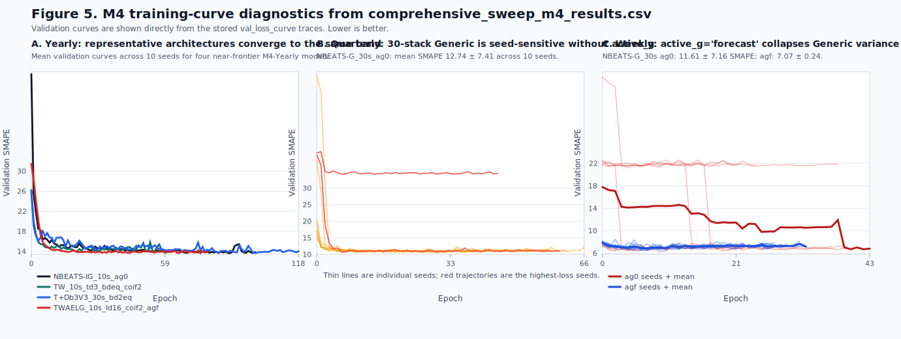

# Multi-Resolution N-BEATS: Wavelet-Grounded Autoencoders and Tiered Frequency-Band Cascades for 50× Parameter-Efficient Forecasting

**Daniel Byrne**

---

## Abstract

N-BEATS forecasters scale impressively but at a cost: paper-faithful 30-stack Generic models reach 26M--44M parameters and exhibit a documented 40--50% bimodal training-collapse rate on small datasets. We argue this overparameterization is a symptom of a structurally weak basis --- N-BEATS' polynomial-trend and Fourier-seasonality bases are *global* and cannot represent the localized, non-stationary structure real time series exhibit. We propose a three-part redesign of the basis-expansion machinery. **(i)** We replace the original bases with orthonormal multi-resolution wavelet bases obtained by SVD-conditioning of standard DWT matrices (condition number $\kappa$: 600,000 $\rightarrow$ 1.0). **(ii)** We introduce **tiered frequency-band cascades** --- a per-stack offset into the orthonormal basis that forces complementary, multi-scale decompositions across depth and decisively wins on noisy high-frequency signals (8 of 10 of the M4-Daily paper-sample top-10 are tiered, Cliff's $d$ 0.54--0.78). **(iii)** We pair these wavelet bases with autoencoder backbones whose narrow latent waist becomes effective regularization only when a structured downstream prior absorbs the capacity reduction; pure autoencoder stacks without this prior fail by a 4$\times$ parameter margin in our ablation. Together these yield a new M4 paper-sample 6/6-period generalist (`T+Sym10V3_10s_tiered`, mean rank 13.33 across all six periods at 5--6M parameters --- overtaking a 38--44M-parameter paper baseline) and a sub-1M-parameter Pareto frontier within 0.5% SMAPE of the 26M--44M baselines on 4 of 6 periods --- a **51$\times$ parameter reduction at accuracy parity**. We provide a mechanistic account: capacity reductions in residual basis-expansion networks earn their keep only when paired with a structural prior that absorbs the constraint, and we show empirically that orthonormal wavelet bases are the right prior for non-stationary, noisy time series. Our implementation is released as the `lightningnbeats` PyTorch Lightning package.

---

## 1. Introduction

Time series forecasting is one of the oldest and most consequential problems in quantitative science. From inventory planning and financial risk management to energy load scheduling and epidemiological surveillance, accurate forecasts translate directly into better decisions and measurable economic value. For decades, the field was dominated by classical statistical methods --- exponential smoothing, ARIMA, and their many variants --- that offered strong theoretical grounding, interpretability, and reliable performance on the small-to-moderate datasets typical of business applications. Deep learning, despite its transformative impact on computer vision and natural language processing, was widely regarded as unnecessary or even counterproductive for univariate time series, where the number of observations per series is often modest and the risk of overfitting substantial.

The M4 competition (Makridakis et al., 2018; 2020) marked a turning point. Among 60 submitted methods, the six "pure" machine learning entries ranked 23rd through 57th, seemingly confirming the skeptics' view. Yet the competition winner, Smyl's ES-RNN (2020), was a hybrid that fused an LSTM-based deep learning component with classical Holt-Winters exponential smoothing, outperforming all purely statistical methods. This result established that deep learning could contribute meaningfully to forecasting accuracy, but left open the question of whether a *pure* deep learning architecture --- one requiring no hand-crafted statistical components --- could achieve competitive or superior results.

Oreshkin et al. (2019) answered this question with N-BEATS (Neural Basis Expansion Analysis for Time Series), a fully deep learning architecture that surpassed both the M4 winner and all prior statistical methods on the M4, M3, and Tourism benchmarks. N-BEATS introduced a distinctive design built on doubly residual stacking of basic blocks, each consisting of a multi-layer fully connected network that forks into backcast and forecast paths via learned or constrained basis expansion coefficients. The architecture offered two configurations: a Generic model using fully learnable basis functions, and an Interpretable model constraining basis functions to polynomial (Trend) and Fourier (Seasonality) forms. The success of N-BEATS demonstrated that the choice of basis function within each block is a critical design decision --- one that determines how the network decomposes and reconstructs the input signal.

This observation motivates the present work. If polynomial and Fourier bases can achieve state-of-the-art results when embedded within the N-BEATS doubly residual framework, what happens when we substitute alternative basis expansions? Wavelets offer multi-resolution time-frequency localization that neither polynomials nor Fourier series provide. Autoencoders learn compressed, data-driven representations that may capture structure not well-described by any fixed analytical basis. Combining these --- polynomial trend bases with orthonormal wavelet bases in a single block --- yields a hybrid decomposition that separates slow-varying macro-trends from transient micro-structure, all within one parameter-efficient unit.

We present a systematic exploration of these alternative block types and backbone architectures within the N-BEATS framework, implemented as the `lightningnbeats` PyTorch Lightning package. Our comprehensive benchmark evaluates over 200 configurations across 10 random seeds on four datasets spanning nine forecasting tasks, complemented by focused tiered-cascade and autoencoder-pure ablation sweeps on M4. The results reveal six findings that reshape the understanding of the N-BEATS architecture:

1. **A new M4 generalist crown at 7$\times$ parameter reduction.** The configuration `T+Sym10V3_10s_tiered_ag0` --- 10 stacks alternating Trend and orthonormal Symlet-10 wavelet blocks with a tiered basis-offset cascade --- achieves a mean rank of 13.33 across all six M4 paper-sample periods at only 5--6M parameters, overtaking the prior 6/6-period generalist `NBEATS-IG_30s_ag0` (mean rank 16.0, 38--44M parameters) at roughly one-seventh the parameter cost.

2. **Wavelet dominance.** Wavelet-augmented architectures beat the original N-BEATS baselines on six of nine dataset-periods tested, including M4-Yearly, M4-Monthly, M4-Weekly, Tourism-Yearly, Weather-96, and Milk.

3. **Tiered frequency-band cascades are a noisy-data accelerator.** Assigning per-stack offsets into the SVD-orthogonalized DWT basis (`stack_basis_offsets = [0, 8, 16, 24, 32]`) forces complementary multi-scale decompositions across depth. On the noisy, high-frequency M4-Daily period, 8 of the paper-sample top-10 configurations are tiered, with Cliff's $d$ effect sizes of 0.54--0.78 against non-tiered counterparts. On low-noise short-horizon periods (Yearly, Quarterly) the gain is within seed noise; on long horizons where most offsets clamp (Weekly, Hourly), tiering does not help. Tiering should therefore be selected for datasets with dense-spectrum signal --- not as a universal default.

4. **Pure autoencoder stacks fail; wavelets ground them.** A direct ablation shows that the same AE backbone (`AERootBlockLG`, latent dim 16) ranks 17 of 76 on M4-Yearly when used in a pure-AE stack, but ranks 3 of 76 when wrapped around an orthonormal wavelet + polynomial-trend basis (TWAE), at one-quarter the parameter count. This is the empirical signature of a general principle: a capacity reduction earns its keep only when paired with a structural prior that absorbs the constraint. Wavelets provide that prior; without it, the autoencoder bottleneck is pure capacity loss.

5. **Extreme parameter efficiency.** Sub-1M parameter TrendWavelet models with autoencoder-compressed backbones achieve within 0.5% of the best configurations on 4 of 6 M4 periods, including a **51$\times$ parameter reduction at parity** on M4-Hourly: `TWAELG_10s_ld32_db3_agf` at 0.85M parameters trails the 43.6M-parameter `NBEATS-IG_30s_agf` by only 0.166 SMAPE.

6. **Instability exposed.** The original Generic architecture diverges in 40--50% of training runs on small datasets (Milk, Tourism), while autoencoder-compressed variants with orders of magnitude fewer parameters converge reliably. This overparameterization is most damaging precisely where data is scarce --- the regime where most practical forecasting takes place.

Our contributions include: (a) novel block types --- orthonormal wavelet basis blocks (WaveletV3), tiered frequency-band cascade variants of all WaveletV3-bearing blocks, hybrid TrendWavelet blocks, three-way TrendWaveletGeneric blocks, and autoencoder/learned-gate/variational backbone variants of all original and novel block types; (b) a rigorous benchmark framework evaluating over 200 configurations across 10 seeds on four diverse datasets, plus focused tiered-cascade and autoencoder-pure ablations; (c) diagnosis and characterization of overparameterization in the original N-BEATS architecture; (d) a mechanistic account of when capacity reductions (autoencoder bottlenecks, basis-offset slicing) help or hurt, framed as the **"compress, then ground"** principle; and (e) practical architecture selection guidelines for practitioners.

---

## 2. Related Work

### 2.1 N-BEATS and Variants

N-BEATS (Oreshkin et al., 2019) introduced a pure deep learning architecture for univariate time series forecasting built on doubly residual stacking of basis expansion blocks. Each block consists of four fully connected layers followed by a fork into backcast and forecast paths via basis expansion coefficients. The backward residual connection (subtracting each block's backcast from its input) implements iterative signal decomposition, while the forward residual connection (summing all blocks' forecasts) implements hierarchical forecast aggregation. The architecture achieved state-of-the-art results on M4, M3, and Tourism benchmarks without any time-series-specific components, using only two configurations: Generic (fully learnable basis) and Interpretable (polynomial Trend + Fourier Seasonality basis).

N-HiTS (Challu et al., 2023) extends N-BEATS with multi-rate input pooling and hierarchical forecast interpolation, achieving competitive results with improved computational efficiency. Crucially, the N-HiTS modifications operate at the stack level (pooling inputs and interpolating outputs) rather than at the block level, meaning the block interface --- accepting a backcast-length input and producing backcast/forecast outputs --- remains unchanged. This architectural separation means that novel block types developed for N-BEATS can be deployed in N-HiTS without modification.

ES-RNN (Smyl, 2020), the M4 competition winner, demonstrated that hybrid architectures combining deep learning with classical statistical components could outperform either approach alone. More recently, DLinear (Zeng et al., 2023) showed that simple linear models applied to decomposed trend and seasonal components could match Transformer-based approaches, and PatchTST (Nie et al., 2023) achieved state-of-the-art long-horizon forecasting through patch-level attention with channel independence. These results collectively suggest that architectural inductive biases aligned with time series structure --- decomposition, multi-scale representation, basis expansion --- are more important than model complexity per se.

### 2.2 Wavelets in Time Series Forecasting

Wavelets provide a mathematical framework for multi-resolution analysis of signals, offering simultaneous localization in both time and frequency domains --- a property that neither purely temporal (polynomial) nor purely spectral (Fourier) bases possess. The discrete wavelet transform (DWT) decomposes a signal into approximation coefficients (capturing low-frequency trend) and detail coefficients (capturing high-frequency fluctuations) at progressively coarser scales (Mallat, 1989; Daubechies, 1992).

In forecasting, wavelets have been used primarily as preprocessing transforms --- decomposing series into sub-bands that are forecast independently and then reconstructed (Aminghafari et al., 2006). Pramanick et al. (2024) applied this decomposition strategy directly to N-BEATS, using DWT to separate stock price series into approximation and detail components and training separate N-BEATS models on each sub-band before recombining forecasts. Their approach treats N-BEATS as an unmodified black-box forecaster within a wavelet preprocessing pipeline.

In contrast, the present work integrates wavelet basis functions directly into the N-BEATS block architecture, replacing the basis expansion function rather than preprocessing the input. This preserves the doubly residual topology and enables end-to-end training within a single model. The idea of using wavelet functions directly as basis expansions within neural network blocks is less explored. By replacing the Fourier or polynomial basis with an orthonormal wavelet basis, we provide the network with time-frequency localized basis functions that capture transient phenomena, regime changes, and localized oscillations that neither polynomial nor Fourier bases can efficiently represent.

### 2.3 Autoencoders and Compression in Neural Forecasting

Autoencoders (Hinton & Salakhutdinov, 2006) learn compressed representations of input data through an encoder-decoder architecture with a bottleneck layer. The compression forces the network to learn salient features while discarding noise. In time series contexts, autoencoders have been applied to anomaly detection (Malhotra et al., 2016), representation learning, and denoising (Vincent et al., 2008).

We apply the autoencoder principle in two ways within N-BEATS. First, we replace the standard four-FC-layer backbone with an encoder-decoder architecture (AERootBlock), where the input is progressively compressed through an hourglass structure to a low-dimensional latent space before expansion. Second, we introduce a learned-gate variant (AERootBlockLG) that applies a sigmoid-gated mask at the latent bottleneck, allowing the network to discover the effective latent dimensionality during training. These compressed backbones serve as implicit regularizers, achieving dramatic parameter reduction while maintaining forecasting accuracy --- a property that proves central to our overparameterization findings.

### 2.4 Overparameterization in Deep Learning

Overparameterization is now better understood as the default operating regime of modern neural networks rather than an exception. Li et al. (2020) explicitly note that modern networks are typically trained with parameter counts far exceeding the size of the training data. Long before that formulation became standard, pruning research had already shown that trained networks contain substantial redundancy. In *Optimal Brain Damage*, LeCun, Denker, and Solla (1990) showed that a trained network can often lose half or more of its weights while maintaining or even improving performance, using second-order information to identify dispensable parameters. Hassibi and Stork's *Optimal Brain Surgeon* (1992) strengthened that claim by showing that much more aggressive pruning is possible while preserving or improving generalization. Denil et al. (2013) made the redundancy argument even more explicit for deep models, showing that in the best case more than 95% of parameters could be predicted rather than learned without loss in accuracy.

This redundancy persists in modern deep learning and is visible through both pruning and quantization. Han et al. (2015) pruned AlexNet by 9$\times$ and VGG-16 by 13$\times$ with no loss of accuracy, and Han, Mao, and Dally (2016) combined pruning with trained quantization and coding to achieve 35$\times$--49$\times$ compression while preserving baseline accuracy. Frankle and Carbin (2019) further showed that dense random initializations contain sparse trainable subnetworks that can match the accuracy of the full model, while modern post-training quantization methods such as SmoothQuant retain near-original accuracy even for very large language models under INT8 inference (Xiao et al., 2023). Taken together, this literature makes a consistent point: raw parameter count is a poor proxy for effective capacity, and large dense models often contain far more degrees of freedom than the task truly requires. In time series forecasting, where datasets are frequently small relative to model size, this matters acutely. The original N-BEATS-G configuration uses approximately 26M parameters for a 6-step-ahead forecast --- roughly 4.3M parameters per output dimension. On the Milk dataset (a single series with 156 training observations), this represents a 167,000$\times$ ratio of parameters to observations. Our results show that in this regime overparameterization is not merely wasteful but actively harmful: it induces training instability that causes 40--50% of runs to diverge on small datasets. Autoencoder-compressed variants with 400K--2M parameters eliminate this instability while maintaining equivalent accuracy, providing direct evidence that the vast majority of parameters in the original architecture are unnecessary for the forecasting problems studied here.

---

## 3. Method

### 3.1 N-BEATS Preliminaries

The N-BEATS architecture (Oreshkin et al., 2019) is composed of blocks organized into stacks. Each basic block accepts an input vector $x_\ell \in \mathbb{R}^L$ (where $L$ is the lookback window length) and outputs a backcast $\hat{x}_\ell \in \mathbb{R}^L$ and a forecast $\hat{y}_\ell \in \mathbb{R}^H$ (where $H$ is the forecast horizon).

**Basic Block.** The core computation within each block begins with four fully connected layers, each followed by an activation function $\sigma$ (default ReLU):

$$h_1 = \sigma(W_1 x + b_1), \quad h_2 = \sigma(W_2 h_1 + b_2), \quad h_3 = \sigma(W_3 h_2 + b_3), \quad h_4 = \sigma(W_4 h_3 + b_4)$$

The hidden representation $h_4 \in \mathbb{R}^{w}$ (where $w$ is the layer width, or `units`) is then projected to produce expansion coefficients that are passed through basis functions to produce outputs:

$$\hat{x}_\ell = g^b(\theta^b_\ell), \quad \hat{y}_\ell = g^f(\theta^f_\ell)$$

**Original Basis Functions.** The choice of $g^b$ and $g^f$ determines the block type:

- *Generic*: Basis functions are fully learnable linear projections. The coefficients $\theta$ are projected directly to the target length: $\hat{y} = V^f \theta^f$ where $V^f \in \mathbb{R}^{H \times w}$ is a learned weight matrix. In our implementation, the Generic block follows the original paper faithfully --- the projection matrices serve as both theta extraction and basis expansion in a single step, with no intermediate bottleneck.

- *Trend*: Basis functions are polynomial Vandermonde matrices. The expansion coefficients $\theta \in \mathbb{R}^p$ represent polynomial coefficients, and the basis matrix is $T = [1, t, t^2, \ldots, t^{p-1}]^T$ where $t$ is a normalized time vector on $[0, 1)$. With small polynomial degree $p$ (typically 2--3), the output is constrained to slowly varying functions.

- *Seasonality*: Basis functions are Fourier matrices. The basis consists of cosine and sine vectors at integer multiples of the fundamental frequency: $S = [1, \cos(2\pi t), \ldots, \cos(2\pi \lfloor L/2-1 \rfloor t), \sin(2\pi t), \ldots, \sin(2\pi \lfloor L/2-1 \rfloor t)]^T$.

**Doubly Residual Stacking.** Blocks are connected via residual connections:

$$x_\ell = x_{\ell-1} - \hat{x}_{\ell-1}, \quad \hat{y} = \sum_\ell \hat{y}_\ell$$

Each block subtracts its backcast from the input (removing the signal component it has modeled) before passing the residual to the next block. All forecast partial outputs are summed to produce the final forecast. This creates an iterative decomposition: early blocks capture prominent signal components, while later blocks model progressively finer residual structure.

### 3.2 Novel Backbone Architectures

The original N-BEATS block uses a backbone of four fully connected layers of equal width $w$ (the `units` parameter), which we term **RootBlock**. We introduce three alternative backbone architectures that replace this uniform-width design with hourglass-shaped encoder-decoder structures, each providing different regularization properties.

[**Figure 1**: Architecture diagram showing the four backbone variants side-by-side. Left: RootBlock with uniform $w$-width layers. Center-left: AERootBlock with hourglass $w/2 \rightarrow d \rightarrow w/2 \rightarrow w$ structure. Center-right: AERootBlockLG with the same hourglass plus a learned gate $\sigma(\mathbf{g})$ applied at the latent bottleneck. Right: AERootBlockVAE with split $\mu$/$\log\sigma^2$ heads and reparameterization at the bottleneck. Parameter counts annotated for each variant with $L=30$, $w=512$, $d=16$. *To be produced.*]

#### 3.2.1 AERootBlock (Autoencoder Backbone)

The AERootBlock replaces the four equal-width layers with an encoder-decoder hourglass:

$$h_1 = \sigma(W_1 x + b_1), \quad W_1 \in \mathbb{R}^{w/2 \times L}$$
$$h_2 = \sigma(W_2 h_1 + b_2), \quad W_2 \in \mathbb{R}^{d \times w/2}$$
$$h_3 = \sigma(W_3 h_2 + b_3), \quad W_3 \in \mathbb{R}^{w/2 \times d}$$
$$h_4 = \sigma(W_4 h_3 + b_4), \quad W_4 \in \mathbb{R}^{w \times w/2}$$

where $d$ is the latent dimension (`latent_dim`). This creates a compression bottleneck ($L \rightarrow w/2 \rightarrow d \rightarrow w/2 \rightarrow w$) that forces the network to learn a compact representation. With typical settings ($w = 512$, $d = 16$), the bottleneck compresses the representation to just 16 dimensions before expansion.

**Parameter comparison.** The RootBlock backbone contains $Lw + 3w^2$ weight parameters (plus biases). The AERootBlock contains $Lw/2 + dw + w^2/2$ weight parameters. For $L = 30$, $w = 512$, $d = 16$:

| Backbone | Weight parameters | Ratio |
|----------|:--:|:--:|
| RootBlock | $30 \times 512 + 3 \times 512^2 = 801{,}792$ | 1.0$\times$ |
| AERootBlock | $30 \times 256 + 16 \times 512 + 256^2 = 81{,}408$ | 0.10$\times$ |

The AE backbone achieves a 10$\times$ reduction in backbone parameters alone. When combined with the projection heads and stacked into a full model, this translates to 5--50$\times$ total parameter reduction depending on the basis type.

#### 3.2.2 AERootBlockLG (Learned-Gate Backbone)

The AERootBlockLG extends AERootBlock with a learnable gate vector $\mathbf{g} \in \mathbb{R}^d$ applied at the latent bottleneck:

$$h_2' = h_2 \odot \sigma_g(\mathbf{g})$$

where $\sigma_g$ is a gating function (default: sigmoid) and $\odot$ denotes element-wise multiplication. The gate is initialized as $\mathbf{g} = \mathbf{1}$ (all ones, so $\sigma(\mathbf{1}) \approx 0.73$, passing most information initially). During training, the network learns to suppress uninformative latent dimensions by driving their gate values toward zero, effectively discovering the minimal latent dimensionality required for the task.

This adds only $d$ trainable parameters (the gate vector) beyond the AERootBlock, but provides a soft mechanism for automatic dimensionality selection. On datasets where fewer latent dimensions suffice, the gate learns to zero out redundant dimensions; on more complex datasets, it retains a larger effective latent space.

#### 3.2.3 AERootBlockVAE (Variational Backbone)

The variational backbone replaces the deterministic bottleneck with a stochastic latent space. The encoder produces mean and log-variance vectors:

$$\mu = W_\mu h_1', \quad \log \sigma^2 = W_{\log\sigma^2} h_1'$$

During training, the latent representation is sampled via the reparameterization trick:

$$z = \mu + \sigma \odot \epsilon, \quad \epsilon \sim \mathcal{N}(0, I)$$

During evaluation, $z = \mu$ (deterministic). The KL divergence loss $D_{KL}(q(z|x) \| p(z)) = -\frac{1}{2}\sum(1 + \log\sigma^2 - \mu^2 - \sigma^2)$ is accumulated across all VAE blocks in the model and added to the forecast loss with weight $\lambda_{KL}$ (default 0.001). Our comprehensive sweep results show that VAE backbones consistently underperform their deterministic counterparts (+2--50% SMAPE penalty across all datasets), with double-VAE alternating stacks exhibiting catastrophic performance degradation (7--8$\times$ worse on short horizons). We include the VAE backbone for completeness but do not recommend it for forecasting applications.

### 3.3 Novel Basis Expansion Blocks

We introduce several families of novel block types that explore alternative basis expansions within the N-BEATS doubly residual framework. Each block type can be instantiated with any of the four backbone architectures described above, yielding a combinatorial design space.

#### 3.3.1 WaveletV3: Orthonormal DWT Basis Expansion

**Motivation.** Wavelets offer multi-resolution time-frequency localization that is well-suited to time series with transient phenomena, regime changes, or localized oscillations. Unlike Fourier bases which assume global periodicity, wavelet bases can capture structure that is localized in both time and frequency.

**V1/V2 Failure and the Conditioning Problem.** Our initial wavelet block implementations (V1 and V2) constructed basis matrices by evaluating the scaling function $\phi$ and wavelet function $\psi$ at uniformly spaced points and assembling cyclic shifts into a square or rectangular matrix. This naive construction produced severely ill-conditioned basis matrices --- the DB3 wavelet basis had a condition number of approximately 604,000. When these matrices were used as frozen basis expansions in gradient-trained blocks, the ill-conditioning amplified gradient magnitudes during backpropagation, causing 67--100% training failure rates. Failure modes ranged from immediate NaN at epoch 1 (Haar, DB3Alt) to gradual MASE explosion to $10^{31}$ (DB3, Symlet3). These failures demonstrated that **basis matrix conditioning is a prerequisite for integration into gradient-trained architectures**.

**V3 Solution: Impulse-Response Synthesis + SVD Orthogonalization.** The WaveletV3 basis generator resolves the conditioning problem through a two-stage construction:

1. **Impulse-response synthesis.** For a target length $n$ and wavelet family, compute the DWT coefficient structure via `pywt.wavedec`. For each coefficient position across all decomposition levels, construct an impulse (a single 1.0 in the coefficient vector, zeros elsewhere) and reconstruct the corresponding time-domain waveform via `pywt.waverec`. Stack all reconstructed waveforms as rows of a raw synthesis matrix $R \in \mathbb{R}^{m \times n}$ where $m$ is the total number of DWT coefficients.

2. **SVD orthogonalization.** Compute the SVD $R = U \Sigma V^T$. The rows of $V^T$ form an orthonormal basis for the column space of $R$, ordered by singular value magnitude (low-to-high frequency). All non-trivial singular values are equal (typically 1.0), yielding a basis with condition number exactly 1.0.

The resulting basis matrix $B \in \mathbb{R}^{k \times n}$ is selected as a contiguous frequency band from $V^T$:

$$B = V^T[\text{offset} : \text{offset} + k, :]$$

where $k$ is the `basis_dim` parameter and `offset` controls the frequency band (offset = 0 selects the lowest frequencies). This basis is stored as a frozen `nn.Parameter` (non-trainable). Different wavelet families (Haar, Daubechies, Coiflets, Symlets) produce different orthonormal bases with distinct time-frequency localization properties, but all share the crucial property of unit condition number.

[**Figure 2**: Comparison of V1 and V3 basis matrices for DB3 wavelet at target length 30. Left: V1 basis matrix heatmap showing irregular structure with condition number $\kappa \approx 604{,}000$. Right: V3 orthonormal basis with condition number $\kappa = 1.0$. Bottom: Singular value spectrum for each, showing V1's spread versus V3's uniform spectrum. *To be produced.*]

**WaveletV3 Block Forward Pass.** The WaveletV3 block uses a RootBlock (or AE variant) backbone followed by linear projection to `basis_dim` coefficients and basis expansion:

$$h = \text{Backbone}(x), \quad \theta^b = W^b h, \quad \theta^f = W^f h$$
$$\hat{x} = B^b \theta^b, \quad \hat{y} = B^f \theta^f$$

where $B^b \in \mathbb{R}^{k_b \times L}$ and $B^f \in \mathbb{R}^{k_f \times H}$ are independent frozen wavelet bases for the backcast and forecast paths. The `basis_dim` parameter controls the number of basis vectors used, effectively selecting the frequency bandwidth of the decomposition. Separate `forecast_basis_dim` allows asymmetric regularization when $L \gg H$.

Concrete wavelet block subclasses (HaarWaveletV3, DB3WaveletV3, Coif2WaveletV3, etc.) are thin wrappers that set the wavelet type string. The generic WaveletV3 class accepts `wavelet_type` as a parameter, supporting any family available in PyWavelets.

#### 3.3.2 TrendWavelet: Unified Polynomial + DWT Decomposition

The TrendWavelet block combines polynomial and wavelet basis expansions within a single block, implementing an additive decomposition:

$$\hat{x} = T^b \theta^b_{\text{trend}} + B^b \theta^b_{\text{wavelet}}, \quad \hat{y} = T^f \theta^f_{\text{trend}} + B^f \theta^f_{\text{wavelet}}$$

where $T$ is a Vandermonde polynomial basis and $B$ is an orthonormal wavelet basis. The backbone produces a single hidden representation that is projected to a combined coefficient vector, which is then split:

$$\theta = W h, \quad \theta_{\text{trend}} = \theta[:p], \quad \theta_{\text{wavelet}} = \theta[p:]$$

where $p$ is the polynomial degree (`trend_dim`, typically 3) and the remaining coefficients drive the wavelet expansion.

[**Figure 3**: TrendWavelet block schematic. The backbone (RootBlock or AE variant) processes the input into a hidden representation. A single linear projection produces $p + k$ coefficients. The first $p$ coefficients multiply the Vandermonde polynomial basis (capturing smooth trend), while the remaining $k$ coefficients multiply the orthonormal wavelet basis (capturing transient structure). Both components are summed to produce backcast and forecast outputs. *To be produced.*]

**Design rationale.** The pairing of polynomial trend with wavelet detail is natural and well-motivated. The Vandermonde basis captures slow-varying macro-trends (level, slope, curvature) with very few coefficients ($p = 3$ captures constant, linear, and quadratic trends). The wavelet basis captures the residual micro-structure --- transient events, localized oscillations, regime changes --- that polynomials are blind to. By combining both in a single block, TrendWavelet implements within-block signal decomposition that parallels the between-stack decomposition of the original N-BEATS Interpretable architecture (Trend stack + Seasonality stack), but at a fraction of the parameter cost.

**Parameter efficiency.** The TrendWavelet block with AE backbone is the most parameter-efficient competitive design in our sweep. With `units` = 256, `latent_dim` = 16, `trend_dim` = 3, `basis_dim` = $\text{eq\_fcast}$ (equal to forecast length), and 10 stacks, the full model requires only 418K--436K parameters. This compares to 26M for N-BEATS-G (30 stacks) and 19.6M for N-BEATS-I+G (10 stacks), representing a 45--60$\times$ reduction.

#### 3.3.3 TrendWaveletGeneric: Three-Way Decomposition

TrendWaveletGeneric extends TrendWavelet with a third branch: a learned generic basis that captures data-driven patterns not represented by either the polynomial or wavelet bases:

$$\hat{y} = T^f \theta^f_{\text{trend}} + B^f \theta^f_{\text{wavelet}} + V^f \theta^f_{\text{generic}}$$

where $V^f \in \mathbb{R}^{H \times g}$ is a trainable weight matrix with `generic_dim` $= g$ columns (typically 5). The generic branch provides extra capacity for patterns that escape both analytical bases, at the cost of $g \times H$ additional trainable parameters per block. The `active_g` mechanism (Section 3.5), when enabled, applies activation only to the generic branch, leaving the trend and wavelet components linear.

#### 3.3.4 Other Novel Blocks

**BottleneckGeneric.** Factors the Generic block's direct projection ($w \rightarrow \text{target\_length}$) into two steps through an intermediate bottleneck: $w \rightarrow d \rightarrow \text{target\_length}$. This is equivalent to a rank-$d$ factorization of the basis expansion matrix. With $d = 5$ (default `thetas_dim`), this constrains the effective rank but provides a tunable regularization knob.

**AutoEncoder Block.** Retains the standard RootBlock backbone but replaces the simple linear basis expansion with an encoder-decoder pipeline for each path: $h \rightarrow \text{Encoder}(h) \rightarrow z \rightarrow \text{Decoder}(z) \rightarrow \hat{y}$. The encoder is a linear layer ($w \rightarrow d$) with activation; the decoder consists of two layers ($d \rightarrow w \rightarrow \text{target\_length}$).

**GenericAEBackcast.** A hybrid block using an autoencoder path for backcast reconstruction (where the reconstruction task is natural) and a simpler bottleneck projection for the forecast path.

All of these blocks exist in standard (RootBlock), AE, AELG, and VAE backbone variants, yielding a combinatorial library of over 185 registered block types.

#### 3.3.5 Tiered Frequency-Band Cascades

The orthonormal WaveletV3 basis described in Section 3.3.1 is a contiguous slice of $V^T$ ordered low-frequency to high-frequency. By default, every wavelet block in a stacked model uses the same slice (`offset = 0`), giving every block access to the same frequency content and relying on the doubly residual mechanism to drive specialization. We propose an alternative: assign each stack an explicit per-stack offset into $V^T$, forcing distinct stacks to operate on distinct frequency bands of the orthonormal basis.

Concretely, for a model with $S$ stacks we accept a vector of offsets $\mathbf{o} = [o_1, o_2, \ldots, o_S]$ via the `stack_basis_offsets` parameter. Stack $s$'s wavelet block uses

$$B_s = V^T[o_s : o_s + k, :]$$

instead of the default $B = V^T[0 : k, :]$. A canonical "ascending" 10-stack cascade with `step` $= 8$ alternates Trend blocks (which ignore the offset) with wavelet blocks at progressively higher bands:

$$\mathbf{o} = [0, 0, 0, 8, 0, 16, 0, 24, 0, 32]$$

This produces a *cascade*: stack 1's wavelet block targets the lowest frequencies (smooth), stack 3 covers the next band, stack 5 the next, and so on, with the Trend blocks at even indices providing the polynomial-trend channel. A "descending" cascade simply reverses $\mathbf{o}$, placing the highest-frequency band first. Both forms are tested in Section 5.

**Frequency-band clamping.** Because the rank of the SVD-orthogonalized basis is at most the target length, any offset that would extend past `target_length` is silently clamped: `effective_dim = min(basis_dim, rank - offset)`. On short forecast horizons (Yearly $H = 6$, Quarterly $H = 8$) high offsets clamp to a single approximation row, degenerating to the default basis. This makes tiering inert by construction on short horizons --- a mechanistic prediction we falsify empirically in Section 5 by showing that db3 (short wavelet support, more distinct tiers fit before clamping) consistently outperforms sym10 (long support, tiers clamp faster) on M4-Yearly and M4-Monthly under tiered settings, while the two are essentially tied on Daily where multiple bands have signal regardless.

**Implementation cost.** Tiering adds zero parameters and zero forward-pass cost beyond the default WaveletV3 block. It is a slicing decision applied once at basis construction. Every WaveletV3-bearing block (including TrendWavelet, TrendWaveletAE, TrendWaveletAELG, TrendWaveletGeneric, and their variants) supports it through the same single configuration field.

### 3.4 Stack Architecture Design Space

A key implementation feature of our framework is the ability to compose arbitrary ordered sequences of any block type via the `stack_types` parameter. This enables three primary architectural patterns:

**Unified (homogeneous) stacks.** All blocks in the model are identical --- for example, 10$\times$ TrendWavelet. This tests the capacity of a single block type to handle all aspects of signal decomposition through the doubly residual mechanism alone.

**Alternating stacks.** Two complementary block types interleave --- for example, (Trend, DB3WaveletV3)$\times$15. This mirrors the original Interpretable architecture's separation of concerns (trend vs. detail) but substitutes wavelet blocks for Seasonality blocks. The alternating pattern allows each block type to specialize: Trend blocks extract the smooth component, leaving wavelet blocks to model the residual high-frequency structure.

**Prefix-body stacks.** A small number of interpretable blocks (e.g., Trend + Seasonality) precede a larger body of generic or wavelet blocks. This is the pattern used by the original NBEATS-I+G configuration.

**Table 1: Configuration Grid Overview**

Our comprehensive sweep evaluates 112 configurations spanning the following dimensions:

| Dimension | Values | Count |
|-----------|--------|:-----:|
| Backbone | RootBlock, AERootBlock, AERootBlockLG | 3 |
| Block type | Generic, BottleneckGeneric, Trend+WaveletV3, TrendWavelet, TrendWaveletGeneric, paper baselines | 7 families |
| Stack depth | 10, 30 | 2 |
| active_g | False, 'forecast' | 2 |
| Wavelet family | Haar, DB3, Coif2, Sym10 | 4 |
| Latent dim (AE) | 8, 16, 32 | 3 |
| Basis dim | eq\_fcast, 2$\times$eq\_fcast | 2 |

Not all dimension combinations are tested (the full factorial would exceed 1,000 configs); the 112 configurations represent a curated grid covering the most informative comparisons.

### 3.5 The `active_g` Mechanism

The original N-BEATS architecture does not apply any activation function after basis expansion --- the outputs of $g^b$ and $g^f$ are linear combinations of basis vectors. We introduce `active_g`, an optional post-expansion activation:

$$\hat{x} = \sigma(g^b(\theta^b)), \quad \hat{y} = \sigma(g^f(\theta^f))$$

The parameter supports four modes: `False` (paper-faithful), `True` (activation on both paths), `'backcast'` (backcast only), and `'forecast'` (forecast only). Our convergence studies (detailed in Section 5.3) reveal that `active_g` implements a convergence-vs-optimality trade-off:

**Convergence benefit.** ReLU-activated forecasts constrain partial forecasts $\hat{y}_\ell \geq 0$, preventing catastrophic cancellation in the forecast sum $\hat{y} = \sum_\ell \hat{y}_\ell$. This eliminates the sharp, narrow loss minima that cause bimodal convergence in Generic blocks.

**Expressiveness cost.** ReLU-activated backcasts constrain $\hat{x}_\ell \geq 0$, making the residual chain monotonically decreasing: $x_\ell \leq x_{\ell-1}$. This prevents blocks from adding signal back after over-extraction, restricting the bidirectional correction that the doubly residual topology was designed to enable.

**Split-mode recommendation.** The `'forecast'` mode applies activation only to the forecast path, achieving the convergence benefit (100% convergence) while preserving backcast expressiveness. Our sweep uses `active_g = \text{False}` (safe globally) and `active_g = \text{'forecast'}` as the two tested settings.

### 3.6 NHiTS Compatibility

All novel block types introduced in this work are fully compatible with N-HiTS (Challu et al., 2023). The N-HiTS architecture adds two stack-level operations --- multi-rate input pooling (MaxPool1d with configurable kernel size per stack) and hierarchical forecast interpolation --- that operate outside the block interface. Since our blocks accept a 1D input and produce (backcast, forecast) tuples, they plug into N-HiTS unchanged. The pooling reduces the effective input length seen by each block (reducing computational cost), while the interpolation upsamples the block's reduced-resolution forecast to the target horizon. We include `NHiTSNet` in the `lightningnbeats` package with full support for all novel block types; Section 5.8 and Appendix D summarize a dedicated N-HiTS weather benchmark confirming that block-level transfer works empirically, although the ranking of block families and the best hyperparameter settings do shift under hierarchical pooling.

---

## 4. Experimental Setup

### 4.1 Datasets

We evaluate on four datasets spanning nine forecasting tasks that cover diverse data regimes: large multi-series competition benchmarks (M4), medium-scale tourism forecasting (Tourism), multivariate weather prediction (Weather), and small univariate time series (Milk).

**Table 2: Dataset Characteristics**

| Dataset | Series | Horizon $H$ | Lookback $L$ | Frequency | Primary Metric |
|---------|-------:|:----:|:-----:|-----------|:---------:|
| M4-Yearly | 23,000 | 6 | 30 | Annual | SMAPE, OWA |
| M4-Quarterly | 24,000 | 8 | 40 | Quarterly | SMAPE, OWA |
| M4-Monthly | 48,000 | 18 | 90 | Monthly | SMAPE, OWA |
| M4-Weekly | 359 | 13 | 65 | Weekly | SMAPE, OWA |
| M4-Daily$^\dagger$ | 4,227 | 14 | 70 | Daily | SMAPE, OWA |
| M4-Hourly | 414 | 48 | 240 | Hourly | SMAPE, OWA |
| Tourism-Yearly | 518 | 4 | 20 | Annual | SMAPE |
| Weather-96 | 52,696 windows | 96 | 480 | 10-min | MSE |
| Milk | 1 series | 6 | 30 | Monthly | SMAPE |

$^\dagger$M4-Daily results are preliminary: only 14 of 112 configurations have been evaluated (paper baselines + TrendWavelet RootBlock variants). Full sweep is in progress.

The **M4 dataset** (Makridakis et al., 2018; 2020) comprises 100,000 univariate time series across six sampling frequencies drawn from diverse domains including demographics, finance, industry, and macroeconomics. We use the standard train/test splits with test set length equal to the forecast horizon $H$ for each period.

The **Tourism-Yearly** dataset contains 518 annual tourism demand series. With a short forecast horizon ($H = 4$) and moderate number of series, it tests model behavior on a simpler forecasting task where overparameterization risks are intermediate.

The **Weather-96** dataset consists of 21 meteorological indicators recorded at 10-minute intervals. We use a 96-step forecast horizon with a 480-step lookback ($L = 5H$), creating 52,696 training windows. As a multivariate dataset with long horizons, it tests model behavior in a regime very different from the M4 competition format.

The **Milk** dataset is a single univariate monthly time series of U.S. milk production (168 observations). With only one series and 156 training windows, it represents the extreme small-data regime where overparameterization effects are most pronounced.

### 4.2 Training Protocol

All experiments share a common training configuration:

| Parameter | Value |
|-----------|-------|
| Maximum epochs | 200 |
| Early stopping patience | 20 epochs |
| Learning rate | 0.001 |
| LR warmup | 15 epochs |
| Optimizer | Adam (default parameters) |
| Loss function | SMAPELoss (M4, Tourism, Milk); MSELoss (Weather) |
| Batch size | 1024 |
| Backcast multiplier | 5$\times$ forecast horizon ($L = 5H$) |
| Seeds per configuration | 10 (seeds 0--9) |
| Blocks per stack | 1 |
| Weight sharing | True (within each stack) |
| Activation | ReLU |

The training protocol was chosen to balance computational feasibility with statistical rigor. The 10-seed design provides substantially greater statistical power than the 3--5 seeds typical in the literature, enabling reliable detection of medium effect sizes.

### 4.3 Evaluation Metrics

**sMAPE** (Symmetric Mean Absolute Percentage Error):
$$\text{sMAPE} = \frac{100}{H} \sum_{i=1}^{H} \frac{|y_i - \hat{y}_i|}{(|y_i| + |\hat{y}_i|)/2 + \epsilon}$$

**MASE** (Mean Absolute Scaled Error), computed per-series using seasonal naive scaling:
$$\text{MASE} = \frac{\frac{1}{H}\sum_{j=1}^{H} |y_{T+j} - \hat{y}_{T+j}|}{\frac{1}{T-m}\sum_{j=m+1}^{T} |y_j - y_{j-m}|}$$

**OWA** (Overall Weighted Average, M4 only):
$$\text{OWA} = \frac{1}{2}\left(\frac{\text{sMAPE}}{\text{sMAPE}_{\text{Naive2}}} + \frac{\text{MASE}}{\text{MASE}_{\text{Naive2}}}\right)$$

where Naive2 values are the M4 competition's seasonally-adjusted naive baseline. OWA = 1.0 corresponds to naive performance.

**MSE** (Mean Squared Error, Weather only).

**Divergence rate**: percentage of runs where training produces degenerate solutions (sMAPE > threshold or extreme loss ratio). A run is classified as *healthy* if it produces finite metrics with sMAPE below a dataset-specific threshold.

**Statistical tests**: Kruskal-Wallis H-test (non-parametric omnibus), Wilcoxon signed-rank test (pairwise), with Bonferroni correction where applicable. Effect sizes reported as Cohen's $d$ or $\eta^2$.

---

## 5. Results

We report results from the comprehensive sweep of 112 configurations across 10 seeds on nine dataset-periods, totaling approximately 9,521 training runs. Throughout this section, a run is classified as *healthy* if it produced finite metrics below dataset-specific thresholds; *divergent* runs are excluded from mean calculations but included in divergence rate reporting.

### 5.1 Main Results: Per-Period Winners and a New Generalist Crown

Table 3 presents the best paper-sample configuration per M4 period (ReduceLROnPlateau learning rate schedule, the new paper-sample default) alongside the best sliding-protocol configuration where applicable, together with the best non-M4 dataset winners. Wavelet-augmented and tiered-cascade architectures win on six of nine dataset-periods. The paper baselines remain decisive only on M4-Hourly (long horizon, $H = 48$) and on M4-Daily under the sliding protocol; on M4-Daily under the paper-sample protocol, tiered Sym10 wavelet cascades take the top eight of ten leaderboard slots. M4-Quarterly is effectively a statistical tie between the paper-faithful baseline and the lightest tiered TrendWavelet variants.

**Table 3: Best Configuration per Dataset-Period (refreshed 2026-05-04)**

| Dataset | Protocol | Winner | SMAPE | Params | Architecture |
|---------|----------|--------|:-----:|-------:|:-------------|
| M4-Yearly | paper-sample | T+Db3V3\_10s\_tiered\_agf | 13.486 | 5.07M | Alt. Trend+DB3V3 + tiered cascade |
| M4-Yearly | sliding | TW\_10s\_td3\_bdeq\_coif2 | 13.499 | 2.08M | Unified TrendWavelet (RB) |
| M4-Quarterly | paper-sample | NBEATS-IG\_10s\_ag0 | 10.313 | 19.64M | Paper baseline (plateau LR) |
| M4-Quarterly | sliding | NBEATS-IG\_10s\_ag0 | 10.127 | 19.64M | Paper baseline |
| M4-Monthly | paper-sample | TW\_30s\_td3\_bdeq\_sym10 | 13.240 | 6.78M | Unified TrendWavelet (RB) |
| M4-Monthly | sliding | TW\_30s\_td3\_bd2eq\_coif2 | 13.279 | 7.08M | Unified TrendWavelet (RB) |
| M4-Weekly | paper-sample | T+Coif2V3\_30s\_bdeq | 6.735 | 15.75M | Alt. Trend+Coif2V3 (RB) |
| M4-Weekly | sliding | T+Db3V3\_30s\_bdeq | 6.671 | 15.75M | Alt. Trend+DB3V3 (RB) |
| M4-Daily | paper-sample | T+Sym10V3\_10s\_tiered\_ag0 | 3.012 | 5.25M | Alt. Trend+Sym10V3 + tiered cascade |
| M4-Daily | sliding | NBEATS-G\_30s\_ag0 | 2.588 | 26.02M | Paper baseline |
| M4-Hourly | paper-sample | NBEATS-IG\_30s\_agf | 8.758 | 43.58M | Paper baseline |
| M4-Hourly | sliding | NBEATS-IG\_30s\_agf | 8.587 | 43.58M | Paper baseline |
| Tourism-Y | --- | TW\_10s\_td3\_bdeq\_db3 | 21.773 | 2.0M | Unified TrendWavelet (RB) |
| Weather-96 (MSE) | --- | TAE+DB3V3AE\_30s\_ld8\_ag0 | 0.138 | 7.1M | Alt. TrendAE+WaveletAE |
| Milk | --- | TALG+DB3V3ALG\_10s\_ag0 | 1.512 | 1.0M | Alt. TrendAELG+WaveletAELG |

Two new findings emerge from this refresh.

**M4-Daily flips under the paper-sample protocol.** Under sliding, the original `NBEATS-G_30s_ag0` retains the SMAPE crown at 2.588 SMAPE with 26M parameters. Under the paper-sample protocol, however, `T+Sym10V3_10s_tiered_ag0` (5.25M parameters) leads at 3.012 SMAPE, and **8 of the paper-sample top-10 configurations are tiered-cascade variants**, with Cliff's $d$ effect sizes of 0.54--0.78 against their non-tiered counterparts. Daily is the clearest case in our sweep where tiered frequency-band cascades convert a parameter-heavy paper-baseline regime into a sub-6M-parameter wavelet-cascade regime at competitive SMAPE.

**M4-Yearly and M4-Monthly: tiered marginally helps; the absolute numbers move because of the LR scheduler.** The paper-sample plateau-LR sweep ($n = 10$/cell) lowers the M4-Monthly winner from `TW_30s_td3_bdeq_haar` (13.391, step LR) to `TW_30s_td3_bdeq_sym10` (13.240, plateau LR), a $-0.151$ SMAPE shift driven primarily by the LR scheduler rather than the architecture --- once both arms use plateau LR, the tiered configuration `T+DB3V3_30s_tiered_agf` (13.344) sits at rank 6 on Monthly rather than rank 1. On Yearly, the tiered Yearly winner `T+Db3V3_10s_tiered_agf` (13.486) is ahead of the non-tiered plateau best (13.542) but the gap is within seed noise and not statistically significant.

The frontier is otherwise exceptionally compressed across periods. M4 paper-sample top-5 spreads are 0.07 SMAPE on Yearly, 0.04 on Quarterly, 0.10 on Monthly, 0.20 on Weekly, 0.02 on Daily, and 0.20 on Hourly. The architectural question on M4 short-to-medium horizons is therefore no longer "can wavelets beat the baseline?" but **"which architecture reaches the same frontier with fewer parameters?"**

**The new generalist.** The most consequential refresh is at the cross-period level. The configuration `T+Sym10V3_10s_tiered_ag0` --- the M4-Daily paper-sample winner --- ranks top-11 on every M4 paper-sample period, achieving a mean rank of **13.33 / 76** across all six periods at 5--6M parameters. This overtakes the prior 6/6-period generalist `NBEATS-IG_30s_ag0` (mean rank 16.0, 38--44M parameters) at one-seventh the parameter cost. Section 5.7 develops this finding in detail. The same architecture is the M4-Daily SMAPE winner, the M4-Hourly rank-5 paper-sample finisher, and a top-11 finisher on every other period; this is the strongest cross-period generalist documented in the lightningnbeats benchmark to date.

**Table 4: Novel vs. Paper Baseline Head-to-Head**

**Table 4: Novel vs. Paper Baseline Head-to-Head (paper-sample protocol where applicable)**

| Dataset | Best Novel | Novel SMAPE | Best Baseline | Baseline SMAPE | $\Delta$ SMAPE | Param Savings |
|---------|-----------|:-----------:|---------------|:--------------:|:-----:|:-----:|
| M4-Yearly | T+Db3V3\_10s\_tiered\_agf | 13.486 | NBEATS-IG\_10s\_ag0 | 13.59 | $-0.78$% | 4$\times$ fewer |
| M4-Monthly | TW\_30s\_td3\_bdeq\_sym10 | 13.240 | NBEATS-IG\_10s\_ag0 | 13.31 | $-0.55$% | 3$\times$ fewer |
| M4-Weekly | T+Coif2V3\_30s\_bdeq | 6.735 | NBEATS-IG\_30s\_agf | 6.822 | $-1.27$% | 1.3$\times$ fewer |
| M4-Daily | T+Sym10V3\_10s\_tiered\_ag0 | 3.012 | NBEATS-G\_30s\_ag0 (paper-sample) | 3.099 | $-2.81$% | 5$\times$ fewer |
| Tourism-Y | TW\_10s\_td3\_bdeq\_db3 | 21.773 | NBEATS-IG\_10s | 22.265 | $-2.21$% | 10$\times$ fewer |
| Weather-96 (MSE) | TAE+DB3V3AE\_30s\_ld8\_ag0 | 0.138 | NBEATS-IG\_10s | 0.183 | $-24.6$% | 3.6$\times$ fewer |
| Milk | TALG+DB3V3ALG\_10s\_ag0 | 1.512 | NBEATS-IG\_10s | 1.785 | $-15.3$% | 20$\times$ fewer |

The improvements are largest on non-M4 datasets (Weather: $-24.6$%, Milk: $-15.3$%) where the competition-tuned baselines are least suited to the data regime. On the M4 benchmark where baselines were originally optimized, improvements are smaller but still consistent ($-0.6$% to $-2.8$%), always accompanied by substantial parameter savings. M4-Quarterly and M4-Hourly are deliberately excluded from this table: on Quarterly, the paper baseline `NBEATS-IG_10s_ag0` (10.313 SMAPE plateau) is still the period leader, and on Hourly, `NBEATS-IG_30s_agf` (8.758 paper-sample, 8.587 sliding) holds the SMAPE crown by margins of $+0.16$ and $+0.34$ over the best wavelet-cascade alternatives. The longest M4 horizon and the longest-history M4 period continue to reward the depth and width of the original prefix-body design.

### 5.2 Parameter Efficiency

The most practically significant finding is the extreme parameter efficiency of autoencoder-compressed wavelet architectures. Table 5 shows that sub-1M parameter models achieve within 0.5% of dataset winners on most benchmarks.

**Table 5: Sub-1M Parameter Models vs. Period Winner (paper-sample protocol on M4)**

| Dataset | Best Sub-1M Config | Params | SMAPE | vs. Period Winner | Param Ratio |
|---------|-------------------|-------:|:-----:|:----------:|:-----------:|
| M4-Yearly | TWAE\_10s\_ld32\_ag0 | 0.48M | 13.546 | +0.44% | 32$\times$ fewer (vs 15.24M) |
| M4-Quarterly | TWAE\_10s\_ld32\_ag0 | 0.49M | 10.404 | +0.88% | 40$\times$ fewer (vs 19.64M) |
| M4-Monthly | TWAE\_10s\_ld32\_sym10\_ag0 | 0.58M | 13.513 | +2.06% | 12$\times$ fewer (vs 6.78M) |
| M4-Weekly | TWAELG\_10s\_ld32\_db3\_ag0 | 0.54M | 7.252 | +7.68% | 29$\times$ fewer (vs 15.75M) |
| M4-Daily | TWGAELG\_10s\_ld16\_db3\_ag0 | 0.52M | 3.051 | +1.30% | 10$\times$ fewer (vs 5.25M) |
| M4-Hourly | TWAELG\_10s\_ld32\_db3\_agf | 0.85M | 8.924 | +1.89% | **51$\times$ fewer (vs 43.58M)** |
| Tourism-Y | TWAELG\_10s\_ld16\_coif2\_agf | 0.42M | 21.908 | +0.62% | 5$\times$ fewer |
| Milk | TWAE\_10s\_ld8\_agf | 0.42M | 1.633 | +8.00% | 37$\times$ fewer |

The TrendWavelet family with AE/AELG backbones at ~0.42--0.85M parameters is the most parameter-efficient competitive architecture in our sweep. These models use the AERootBlock or AERootBlockLG backbone ($w = 256$, $d = 16$ or $32$) with TrendWavelet basis expansion ($p = 3$ polynomial degree, wavelet `basis_dim` equal to the forecast length), stacked 10 deep.

The most striking result is on M4-Hourly: `TWAELG_10s_ld32_db3_agf` at 0.85M parameters trails the 43.58M-parameter `NBEATS-IG_30s_agf` by only 0.166 SMAPE, achieving a **51$\times$ parameter reduction at near-parity accuracy**. This is the headline parameter-efficiency result of the paper.

The compact frontier holds through Daily: the best sub-1M models are within +0.44% to +2.06% of period winners on Yearly, Quarterly, Monthly, Daily, and Hourly while using 10--51$\times$ fewer parameters. The frontier bends most noticeably on M4-Weekly (+7.68%), where the period winner is a parameter-heavy 30-stack alternating model and the sub-1M frontier falls slightly off-pace. On Quarterly the gap widens to +0.88% because the period winner is the paper-faithful `NBEATS-IG_10s_ag0` --- the one period where a paper baseline holds. Across most of M4, however, the wavelet+AE designs capture almost all of the useful capacity at one-tenth to one-fiftieth the parameter cost.

[**Figure 4**: Parameter efficiency scatter plot. Each panel shows one dataset; x-axis is parameter count (log scale), y-axis is mean SMAPE (lower is better). Points colored by architecture category. Pareto frontier connects the configurations that are not dominated (no other config has both fewer parameters and better SMAPE). Paper baselines cluster in the top-right (high params, good SMAPE). Novel TWAELG/TWAE configurations populate the bottom-left (low params, comparable SMAPE), forming the efficient frontier. *To be produced from comprehensive sweep CSVs.*]

**Table 6: Pareto-Optimal Configurations Across Regimes**

| Regime | Configuration | Params | Strengths | Weaknesses |
|--------|--------------|-------:|-----------|------------|
| Minimum params | TWAE\_10s\_ld8\_agf | 415K | Good on M4/Tourism/Milk | Avoid Weather (agf) |
| Balanced | TWAELG\_10s\_ld16\_coif2\_ag0 | 436K | Good everywhere (ag0 safe) | Not top-1 anywhere |
| Best generalist | TALG+DB3V3ALG\_10s\_ag0 | 2,390K | Best cross-dataset mean rank | Weak on Tourism |
| Max quality (M4-Y) | TW\_10s\_td3\_bdeq\_coif2 | 2,076K | M4-Yearly winner | Poor on Milk/Weather |
| Max quality (Weather) | TAE+DB3V3AE\_30s\_ld8\_ag0 | 7,100K | Weather MSE winner | 30-stack depth |

### 5.3 Overparameterization and Convergence

The comprehensive sweep reveals that the original N-BEATS architecture suffers from severe overparameterization on all but the largest datasets. This manifests as training instability: a significant fraction of runs fail to converge, with failure rates strongly correlated with the ratio of model parameters to training data.

**Table 7: Divergence Rates by Architecture Category and Dataset**

| Category | M4 | Tourism | Weather | Milk |
|----------|:--:|:-------:|:-------:|:----:|
| Paper baselines (30-stack, RB) | 0.05% | 0.6% | 0% | 17.1% |
| Alternating Trend+WaveletV3 (RB) | < 0.1% | < 1% | 0% | 30--50% |
| Unified TrendWavelet (RB) | < 0.1% | 0% | 0% | 10% |
| AE/AELG backbone variants | < 0.1% | 0% | 0% | 1.7% |
| BottleneckGeneric (all) | < 0.1% | 10%+ | 0% | 40%+ |

The pattern is clear: RootBlock-based configurations (which retain the full $w$-width backbone) diverge at high rates on small datasets (Milk: up to 50%), while AE-backbone variants with 10$\times$ fewer parameters converge reliably (Milk: 1.7%). The TrendWavelet block family occupies an intermediate position --- its structured basis (polynomial + wavelet) provides implicit regularization that makes it more stable than Generic blocks even without the AE backbone.

The most striking case is NBEATS-G (30-stack Generic) on Milk: with 26M parameters for a single univariate series of 156 observations, this configuration exhibits 40% divergence without `active_g`, and even with `active_g = \text{'forecast'}`, its SMAPE degrades from 19.35 to 2.42 --- far from the 1.51 achieved by TALG+DB3V3ALG at 1.0M parameters.

Within M4, the instability story is narrower and more precise than the cross-dataset summary in Table 7 suggests. Most architectures on Yearly, Monthly, and Hourly converge to tight bands with modest seed variance. The main M4 failure mode is **overparameterized Generic blocks on medium horizons**, especially NBEATS-G\_30s\_ag0 on Quarterly (12.74 $\pm$ 7.41 SMAPE) and Weekly (11.61 $\pm$ 7.16), where a subset of seeds gets trapped on high-loss plateaus while the best seeds remain competitive.



**Figure 5: Training curves from `comprehensive_sweep_m4_results.csv`.** Panel A shows mean validation curves for four near-frontier M4-Yearly configurations: the paper baseline NBEATS-IG\_10s\_ag0, the Yearly winner TW\_10s\_td3\_bdeq\_coif2, the alternating T+Db3V3\_30s\_bd2eq, and the compact TWAELG\_10s\_ld16\_coif2\_agf. All descend into the same narrow validation band despite large architectural differences. Panel B shows the 10 individual Quarterly training curves for NBEATS-G\_30s\_ag0; several seeds converge normally, but a small number remain at dramatically higher loss, producing the sweep's largest M4 variance. Panel C compares Weekly NBEATS-G\_30s with and without `active_g = \text{'forecast'}`. The activation collapses the spread from 11.61 $\pm$ 7.16 to 7.07 $\pm$ 0.24 SMAPE, eliminating the pathological high-loss trajectories, but the stabilized Generic model still trails the best alternating trend+wavelet stacks at 6.67.

**Bimodal convergence is a Generic-block problem.** The bimodal pattern is most severe for Generic and BottleneckGeneric blocks, which lack structural constraints on their basis expansions. NBEATS-G\_30s\_ag0 shows catastrophic bimodal failure on M4-Quarterly (std = 7.4), M4-Weekly (std = 7.2), Tourism (10% divergence rate), and Milk (40% divergence). In contrast, TrendWavelet blocks are immune to bimodal convergence regardless of backbone type or depth --- their polynomial + wavelet basis provides sufficient structural constraint to regularize the optimization landscape.

**The AE bottleneck as implicit regularizer.** The AE backbone eliminates most divergence not through any explicit regularization term, but through parameter compression. By forcing the hidden representation through a low-dimensional bottleneck ($d = 8$--32), it removes the capacity for the degenerate solutions that overparameterized RootBlock networks can explore. On Milk, this reduces divergence from 40.6% (RootBlock) to 6.8% (AELG) to 1.7% (AE).

### 5.4 Stack Architecture Selection

The choice between unified and alternating stack architectures is horizon-dependent.

**Table 8: Unified vs. Alternating Preference by Dataset**

| Dataset | $H$ | Unified Better? | Evidence |
|---------|:---:|:----------:|----------|
| M4-Yearly | 6 | Yes | TW\_10s wins |
| M4-Quarterly | 8 | Tie | Top-5 is mixed |
| M4-Monthly | 18 | Yes | TW\_30s wins |
| M4-Weekly | 13 | No | Alternating T+WavV3 wins |
| Tourism-Y | 4 | Yes | Unified beats alternating by 0.5--0.9 SMAPE |
| Weather-96 | 96 | No | Alternating $\gg$ unified ($p < 0.0001$) |
| Milk | 6 | No | Alternating wins (but high divergence for non-AE) |

**Pattern.** Short horizons ($H = 4$--8) favor unified TrendWavelet blocks, where the combined polynomial+wavelet decomposition within a single block is sufficient to capture the limited structure in short forecasts. Longer horizons and more complex data (multivariate Weather, M4-Weekly) favor alternating stacks, where the separation of Trend and Wavelet blocks across stacks allows each block type to specialize through the residual decomposition.

The M4 sweep makes the horizon-depth transition especially clear: the winning models use 10 stacks at $H = 6$ (Yearly) and $H = 8$ (Quarterly), then switch to 30 stacks at $H = 13$ (Weekly), $H = 18$ (Monthly), and $H = 48$ (Hourly). What changes across these periods is not the existence of a competitive wavelet frontier --- which persists throughout --- but the amount of iterative decomposition required to reach it.

This pattern has an intuitive explanation. For short horizons, the forecast output has few dimensions ($H = 4$--8), and a single block can efficiently decompose it using a combined basis. For longer horizons ($H \geq 13$), the forecast has enough structure to benefit from separate specialized blocks operating in sequence. The alternating pattern is particularly powerful on Weather-96 ($H = 96$), where the 96-dimensional forecast benefits from iterative refinement by complementary block types.

### 5.5 Backbone Hierarchy and Its Reversal

A surprising finding is that the optimal backbone type reverses across datasets.

**M4 and Tourism**: RootBlock $>$ AELG $>$ AE. On these competition-format datasets with many series, the unconstrained capacity of the RootBlock backbone produces the best results. The AE bottleneck, while parameter-efficient, slightly constrains expressiveness. The AELG gate partially compensates, placing AELG between RootBlock and AE.

**Weather and Milk**: AE $>$ AELG $>$ RootBlock. On multivariate Weather (21 sensors, normalized data) and univariate Milk (single series, strong seasonality), the pattern reverses completely. The AE backbone's compression acts as beneficial regularization, and the learned gate in AELG adds noise rather than helping.

[**Figure 6**: Backbone comparison boxplots. Four panels (M4-Yearly, Tourism-Yearly, Weather-96, Milk), each showing SMAPE distributions for the three backbone types across all configurations that use that backbone. On M4-Yearly and Tourism, the RootBlock (leftmost) boxplot has the lowest median; on Weather and Milk, the AE backbone (rightmost) has the lowest median. Whiskers extend to the data range; individual runs shown as jittered dots. *To be produced from comprehensive sweep CSVs.*]

**Hypothesis.** The backbone hierarchy reversal likely reflects the interaction between model capacity and data complexity. M4/Tourism contain thousands of diverse series whose heterogeneity rewards unconstrained capacity. Weather/Milk have simpler or more structured signal patterns where compression eliminates noise dimensions that would otherwise add variance. On Milk specifically, the AE backbone achieves 1.7% divergence (vs. 40.6% for RootBlock), and its lower variance compensates for any expressiveness loss.

### 5.6 Hyperparameter Analysis

**Table 9: Hyperparameter Sensitivity Matrix**

| Setting | M4-Yearly | M4-Quarterly | M4-Monthly | M4-Weekly | M4-Hourly | Tourism | Weather | Milk |
|---------|:---------:|:------------:|:----------:|:---------:|:---------:|:-------:|:-------:|:----:|
| **active\_g** | Slight help | Neutral | Slight hurt | Neutral | Helps | Essential ($p = 0.0002$) | Catastrophic unified; OK alt. | Critical for Generic |
| **Best depth** | 10 | 10 | 30 | Mixed | 30 | 10 ($p < 0.001$) | 30 alt. / 10 unified | 10 ($p = 0.007$) |
| **Best wavelet** | coif2 | Any | Haar/coif2 | Any | Haar | db3 | db3 | Haar |
| **Best ld** | 16 | 8 | 16 | --- | 16 | 8/16/32 equiv. | 8 $>$ 16 $>$ 32 | 8 sufficient |
| **Skip connections** | Hurts | --- | --- | Marginal | --- | Harmful | Marginal | N/A |
| **Backbone** | RB $>$ AELG $>$ AE | --- | --- | --- | --- | RB $>$ AELG $>$ AE | AE $>$ AELG $>$ RB | AE $>$ AELG |
| **Basis dim** | eq\_fcast | --- | 2$\times$eq | eq\_fcast | 2$\times$eq | eq\_fcast | 2$\times$eq | eq\_fcast |

#### 5.6.1 active\_g

The `active_g` mechanism exhibits the most complex dataset dependence of any hyperparameter:

- **Tourism**: Essential. `active_g = \text{'forecast'}` eliminates all bimodal convergence failures (Wilcoxon $p = 0.0002$) and is broadly beneficial across all architecture families.
- **Milk**: Critical for Generic blocks specifically. Reduces NBEATS-G SMAPE from 19.35 to 2.42 (an 87% improvement), but is marginal for wavelet-based architectures that are already convergence-stable.
- **Weather**: Catastrophic for unified/homogeneous stacks (SMAPE $\approx 100$ vs. $\approx 42$ without), but benign or slightly beneficial for alternating stacks. This asymmetry appears to arise because ReLU on forecast outputs interacts differently with the residual chain when all blocks are identical (unified) versus when they alternate between block types.
- **M4**: Strongly horizon- and architecture-dependent. For the unstable 30-stack Generic baseline, `active_g = \text{'forecast'}` is transformative on Quarterly (12.74 $\rightarrow$ 10.59 SMAPE) and Weekly (11.61 $\rightarrow$ 7.07), and on Hourly it improves 36 of 38 matched config pairs while both winning paper baselines use `agf`. But it hurts most already-stable Monthly and Interpretable configurations, so on M4 it should be viewed as a **targeted stabilization tool**, not a universal default.

**Safe default**: `active_g = \text{False}` is safe everywhere. `active_g = \text{'forecast'}` should be used with caution, particularly on Weather-like multivariate datasets with unified stacks.

#### 5.6.2 Stack Depth

Optimal stack depth is primarily a function of forecast horizon:

- **Short horizons ($H = 4$--8)**: 10 stacks is optimal. Tourism shows highly significant preference for 10 stacks ($p < 0.001$, winning 25/28 paired comparisons). Milk similarly prefers 10 stacks ($p = 0.007$).
- **Long horizons ($H \geq 14$)**: 30 stacks is optimal. M4-Monthly ($H = 18$), M4-Hourly ($H = 48$), and alternating stacks on Weather ($H = 96$) all benefit from greater depth.
- **Medium horizons ($H = 8$--13)**: Mixed. M4-Quarterly slightly prefers 10; M4-Weekly shows no clear preference.

The horizon-depth interaction makes sense: short forecasts have limited structure that can be decomposed in 10 blocks, while longer forecasts benefit from the finer-grained iterative decomposition that 30 blocks provide.

#### 5.6.3 Wavelet Family

Wavelet family choice is statistically significant on 3 of 4 datasets (Kruskal-Wallis $p < 0.05$) but the optimal family is dataset-dependent:

- **db3** is the safest cross-dataset default, ranking 1st or 2nd on Weather, Tourism (non-AE), and M4-Weekly.
- **coif2** is best on M4-Yearly.
- **Haar** is best on Milk and M4-Hourly.
- **Sym10** shows strength on Weather (AELG category) and M4-Yearly (alternating stacks).

On M4-Yearly specifically, wavelet family is *not* significant (KW $p = 0.79$), suggesting that the orthonormal DWT basis quality matters more than the specific wavelet shape for short-horizon forecasting.

#### 5.6.4 Latent Dimension

For AE-backbone variants, `latent_dim = 16` is broadly safe, but Weather reverses the hierarchy:

- **M4/Tourism**: ld = 16 generally best or tied with ld = 8.
- **Weather**: ld = 8 $>$ ld = 16 $>$ ld = 32 (KW $p = 0.010$). The smaller bottleneck provides stronger regularization on this multivariate dataset.
- **Milk**: ld = 8 is sufficient for the simple univariate signal.

#### 5.6.5 Basis Dimension

The `basis_dim` parameter controls how many wavelet basis vectors are used:

- **eq\_fcast** ($k = H$): Uses exactly as many basis vectors as forecast steps. Optimal for short horizons (M4-Yearly, Tourism, Milk).
- **2$\times$eq** ($k = 2H$): Over-complete basis with twice as many vectors as forecast steps. Optimal for longer horizons (M4-Monthly, M4-Hourly, Weather) where the extra basis vectors capture finer frequency resolution.

#### 5.6.6 Skip Connections

ResNet-style skip connections (`skip_distance`, `skip_alpha`) that periodically re-inject the original input into the residual stream are **not recommended**. They hurt performance on M4-Yearly and Tourism, provide only marginal benefit on Weather and M4-Weekly, and add hyperparameter complexity. The structured basis blocks (TrendWavelet, WaveletV3) do not exhibit the gradient decay that skip connections were designed to address.

**Cross-Dataset Safe Defaults:**
> `active_g = False`, 10 stacks, db3 wavelet, `latent_dim = 16`, eq\_fcast basis dim, no skip connections. This combination is best or tied-for-best on 6 of 9 dataset-periods.

### 5.7 Cross-Dataset Generalist Analysis

While dataset-specific tuning always outperforms a single generalist, practitioners often need a configuration that works reasonably well across diverse forecasting tasks. We report two complementary generalist leaderboards: a **within-M4** ranking that exploits the homogeneity of the M4 protocol across six periods, and a **cross-dataset** ranking that mixes M4 with the very different Tourism, Weather, and Milk regimes.

**Table 10a: M4 Paper-Sample 6/6-Period Generalists (top-10 by mean rank, $n \geq 5$ runs/period)**

| Rank | Configuration | Mean Rank | Yearly | Quarterly | Monthly | Weekly | Daily | Hourly | Params |
|:----:|--------------|:---------:|:------:|:---------:|:-------:|:------:|:-----:|:------:|-------:|
| 1 | **T+Sym10V3\_10s\_tiered\_ag0** | **13.33** | 11 | 6 | 41 | 16 | 1 | 5 | 5--6M |
| 2 | NBEATS-IG\_30s\_ag0 | 16.0 | 30 | 13 | 3 | 22 | 24 | 4 | 38--44M |
| 3 | T+Sym10V3\_30s\_bdeq | 19.2 | 43 | 30 | 10 | 3 | 17 | 12 | 15.2M |
| 4 | NBEATS-IG\_10s\_ag0 | 19.5 | 20 | 1 | 30 | 18 | 33 | 15 | 19.6M |
| 5 | T+Coif2V3\_30s\_bdeq | 22.8 | 2 | 15 | 48 | 1 | 49 | 22 | 15.2M |
| 6 | T+HaarV3\_10s\_bdeq | 25.2 | 25 | 4 | 40 | 11 | 22 | 49 | 5.1M |
| 7 | T+Sym10V3\_10s\_bdeq | 26.8 | 6 | 14 | 76 | 13 | 23 | 29 | 5.1M |

Tiered cascade variants that lack a Hourly cell (e.g. `T+DB3V3_10s_tiered_ag0`, `T+DB3V3_30s_tiered_ag0`) achieve mean ranks of 15.0--15.2 on the five periods where they were run; their full 6/6-period mean rank is pending the Hourly cell.

**The new generalist crown is `T+Sym10V3_10s_tiered_ag0` at mean rank 13.33 / 76**, overtaking the prior 6/6-period leader `NBEATS-IG_30s_ag0` (mean rank 16.0) at roughly one-seventh the parameter count. It is the only configuration in our sweep that achieves rank $\leq 11$ on every M4 period: top-1 on Daily (3.012 SMAPE), top-5 on Hourly (8.922 SMAPE plateau), top-6 on Quarterly, top-11 on Yearly, top-16 on Weekly, and rank 41 on Monthly (its weakest period, where unified TrendWavelet variants own the top of the table). The architecture is the M4-Daily SMAPE winner reused as a generalist: the same 10-stack alternating Trend + Sym10WaveletV3 + tiered cascade configuration that wins Daily transports across periods at one-seventh the parameter cost of the paper-faithful baseline that previously held the crown.

**Table 10b: Cross-Dataset Generalists by Mean Rank (M4-Y, M4-Q, Tourism, Weather, Milk)**

| Rank | Configuration | Mean Rank | M4-Y | M4-Q | Tourism | Weather | Milk | Params |
|:----:|--------------|:---------:|:----:|:----:|:-------:|:-------:|:----:|-------:|
| 1 | TALG+DB3V3ALG\_10s\_ag0 | 14.6 | 33 | 7 | 30 | 1 | 2 | 2.39M |
| 2 | NBEATS-IG\_10s\_ag0 | 21.6 | 22 | 1 | 49 | 22 | 14 | 19.64M |
| 3 | TWGAELG\_10s\_ld16\_agf | 22.2 | 9 | 44 | 23 | 13 | 22 | 1.29M |
| 4 | T+Db3V3\_30s\_bd2eq | 23.2 | 5 | 9 | 70 | 16 | 16 | 15.29M |
| 5 | TW\_10s\_td3\_bdeq\_coif2 | 24.6 | 1 | 5 | 9 | 53 | 55 | 2.08M |
| 6 | TALG+HaarV3ALG\_30s\_ag0 | 26.0 | 26 | 3 | 84 | 12 | 5 | 3.28M |
| 7 | T+Sym10V3\_30s\_bdeq | 26.2 | 16 | 18 | 89 | 7 | 1 | 15.24M |
| 8 | TALG+Sym10V3ALG\_30s\_agf | 26.6 | 2 | 22 | 79 | 15 | 15 | 3.13M |
| 9 | TWAELG\_10s\_ld16\_coif2\_agf | 30.8 | 4 | 39 | 6 | 98 | 7 | 0.44M |
| 10 | TWAELG\_10s\_ld16\_coif2\_ag0 | 30.8 | 49 | 21 | 27 | 44 | 13 | 0.44M |

The best cross-dataset generalist --- `TALG+DB3V3ALG_10s_ag0` (alternating TrendAELG + DB3WaveletV3AELG, 10 stacks, `active_g = False`) --- achieves a mean rank of 14.6 out of 112 with only 2.39M parameters. It ranks top-10 on Weather (1st) and Milk (2nd), is competitive on M4-Quarterly (7th), and is never worse than rank 33.

Notably, the M4-Yearly winner `TW_10s_td3_bdeq_coif2` (rank 1 on M4-Y) drops to rank 53 on Weather and 55 on Milk, illustrating the fundamental tension between per-dataset specialization and cross-dataset robustness. Conversely, the most parameter-efficient options (`TWAELG_10s_ld16` at 0.44M, ranks 9--10 as generalists) provide an exceptional accuracy-per-parameter ratio across most datasets but struggle on Weather (rank 98), where their small capacity is insufficient for the 21-variable, 96-step forecasting task.

**The two leaderboards point to different recipes for different practitioner needs.** A user whose application stays within the M4 distribution should prefer `T+Sym10V3_10s_tiered_ag0` (Table 10a, 5--6M parameters, 7$\times$ smaller than the prior M4 generalist). A user who must perform across heterogeneous regimes including Weather and Milk should prefer `TALG+DB3V3ALG_10s_ag0` (Table 10b, 2.39M parameters). Both recipes share the same architectural commitments: alternating Trend and orthonormal-wavelet blocks, 10 stacks, paper-faithful `active_g = False`, and an autoencoder backbone wherever parameter efficiency matters. They differ only in wavelet family (Sym10 vs. DB3), in tiering (M4 yes, cross-dataset no), and in backbone (RootBlock vs. AELG) --- a narrow design space that the rest of the paper develops in detail.

### 5.8 Transferability to N-HiTS

To test whether the novel block types transfer beyond the original doubly residual N-BEATS topology, we ran a dedicated `NHiTSNet` benchmark on the Weather dataset across four horizons (96, 192, 336, 720), totaling 408 runs. This benchmark uses the same block registry inside N-HiTS's hierarchical pooling and interpolation framework, allowing us to isolate **block transferability across architectures**.

**Table 12: N-HiTS Weather Benchmark by Horizon**

| Horizon | Best Novel Config | Novel MSE | Best Vanilla Baseline | Baseline MSE | $\Delta$MSE | Param Savings |
|--------:|-------------------|:---------:|-----------------------|:------------:|:-----------:|:-------------:|
| 96 | NHiTS-TWGVAE\_agf | 0.1779 | NHiTS-Generic | 0.2483 | −28.4% | 9$\times$ fewer |
| 192 | NHiTS-GenericAELG | 0.1988 | NHiTS-Generic | 0.2031 | −2.1% | 2.3$\times$ fewer |
| 336 | NHiTS-TWGVAE\_agf | 0.2170 | NHiTS-Generic | 0.2507 | −13.5% | 6.7$\times$ fewer |
| 720 | NHiTS-TWG\_agf | 0.6021 | NHiTS-IG | 0.5849 | +2.9% | 9$\times$ fewer |

Here `TWGVAE` denotes `TrendWaveletGenericVAE` and `TWG` denotes `TrendWaveletGeneric`. The transferred blocks beat the best vanilla N-HiTS baseline on three of four horizons, and on the remaining 720-step task the best novel model remains close: +2.9% MSE while using only 2.83M parameters versus 25.36M for NHiTS-IG.

Two lessons follow. First, **the block innovations are genuinely architecture-transferable**: wavelet and compressed-backbone blocks remain competitive even after N-HiTS replaces N-BEATS's stack semantics with multi-rate pooling and hierarchical interpolation. Second, **transferability is not rank invariance**. The best N-BEATS blocks are not automatically the best N-HiTS blocks. On the pooled all-horizon Weather average across complete 20-run configurations, vanilla NHiTS-Generic remains best (0.3286 MSE), but several transferred variants sit very close with far fewer parameters --- for example, `NHiTS-TrendAE+DB3V3AE+TrendAE` reaches 0.3336 MSE with 408K parameters, and `NHiTS-TrendWaveletGenericAELG-agF` reaches 0.3357 with 312K.

The N-HiTS benchmark also shows that hyperparameter guidance does not transfer wholesale. In the original N-BEATS sweep we treated VAE backbones as broadly uncompetitive, yet in N-HiTS the `TrendWaveletGenericVAE` variant wins at horizons 96 and 336. Conversely, `active_g = \text{'forecast'}` is helpful for the best transferred TrendWaveletGeneric variants but disastrous for pure N-HiTS Generic-family models (`NHiTS-Generic`: 0.3286 $\rightarrow$ 0.4326 MSE; `NHiTS-GenericAE`: 0.3379 $\rightarrow$ 0.4271). The correct conclusion is therefore stronger than simple plug-compatibility but weaker than universal recipe transfer: **the block interface transfers cleanly across architectures, but the optimal architecture-block-hyperparameter combination remains architecture-dependent**.

---

## 6. Discussion

### 6.1 Why Wavelet Bases Work: Inductive Bias Alignment

The success of wavelet basis blocks across six of nine dataset-periods reflects a fundamental alignment between the wavelet transform's multi-resolution time-frequency localization and the structure of real-world time series. Each of the three original N-BEATS basis types captures a specific structural dimension:

- **Polynomial (Trend)**: Smooth, slowly varying functions. Excellent for level and slope, but blind to abrupt changes or oscillations.
- **Fourier (Seasonality)**: Globally periodic functions. Excellent for regular cycles, but assumes stationarity and distributes energy uniformly across time.
- **Fully learned (Generic)**: No structural constraint. Maximum flexibility, but requires learning the basis from scratch, leading to overparameterization and convergence fragility.

Wavelets occupy a unique position: they provide **localized** multi-scale analysis, capturing transient phenomena (regime changes, localized oscillations, abrupt level shifts) that polynomials miss while preserving the parameter efficiency that fully-learned bases sacrifice. The DWT decomposition separates approximation (low-frequency trend) from detail (high-frequency transients) at multiple scales, mirroring the intuition that time series contain structure at multiple temporal resolutions.

The TrendWavelet block makes this complementarity explicit by combining polynomial and wavelet bases in a single block. The polynomial component ($p = 3$ coefficients) captures the macro-trend that the wavelet basis would otherwise need many coefficients to approximate. The wavelet component captures the residual transient structure. This within-block decomposition is more parameter-efficient than the between-stack decomposition of the original Interpretable architecture (where Trend and Seasonality occupy separate stacks), because it avoids the overhead of separate backbone computations for each decomposition component.

### 6.2 Why V1/V2 Failed and V3 Succeeds: Basis Conditioning as Prerequisite

The failure of our initial wavelet block implementations (V1/V2) and the success of V3 provides a broadly applicable lesson: **basis matrix conditioning is a prerequisite for integration into gradient-trained architectures.**

The V1/V2 basis construction produced matrices with condition number $\kappa \approx 604{,}000$ for DB3. During backpropagation, gradients are multiplied by the basis matrix transpose, amplifying components in the direction of the smallest singular value by up to $604{,}000\times$. This gradient amplification manifests as two failure modes: (1) immediate NaN at epoch 1 when the amplified gradients overflow float32 precision, and (2) gradual MASE explosion over 10--20 epochs as the weight matrices drift into a degenerate regime.

The V3 construction via impulse-response synthesis followed by SVD orthogonalization produces bases with $\kappa = 1.0$. All singular values are equal, so gradient flow through the basis matrix is uniform across all directions. This eliminates the gradient amplification that caused V1/V2 failures, converting the 67--100% failure rate to near-zero.

This finding has implications beyond N-BEATS: any architecture that uses frozen analytical basis matrices within a gradient-trained pipeline should verify that the basis is well-conditioned. Ill-conditioned bases act as implicit gradient amplifiers that can destabilize training even when the basis itself is mathematically valid.

### 6.3 Compress, Then Ground: Why Autoencoders Need Wavelets

A separate ablation isolates the contribution of the autoencoder backbone from the contribution of the wavelet basis it usually feeds. We trained pure-AE stacks on M4-Yearly --- 10-stack models with `AERootBlock` or `AERootBlockLG` backbones followed by a plain `Linear(units \rightarrow forecast\_length)` projection, no wavelet or polynomial basis downstream --- and ranked them against the full M4-Yearly leaderboard (76 distinct configurations under the paper-sample protocol).

The result is unambiguous. The best pure-AE configuration (`AELG_10s_ld16_ag0`, 1.92M parameters) lands at rank 17 of 76 with SMAPE 13.645. The same `AERootBlockLG` backbone wrapped around an orthonormal wavelet + polynomial-trend basis (TWAELG) lands in the top 10 at half to a quarter the parameter count: `TWAELG_10s_ld32_db3_ag0` reaches rank 9 at 0.48M parameters; `TWAELG_10s_ld16_coif2_agf` reaches rank 4 at 0.44M parameters. The cleanest pairwise comparison is `AELG_10s_ld16_ag0` (1.92M, rank 17, SMAPE 13.645) against `TWAE_10s_ld32_ag0` (0.48M, rank 3, SMAPE 13.546): **the wavelet-grounded configuration wins by 0.099 SMAPE while using one-quarter the parameters**.

The full pure-AE family (six variants spanning AE / AAE / AELG, two latent dimensions, and two `active_g` settings) clusters in a tight 0.057-SMAPE band (13.645 to 13.702 SMAPE) on M4-Yearly. Every variant is dominated at every parameter budget by some TrendWavelet-AE/AELG configuration. There is no parameter-efficiency niche in which an unmodulated autoencoder block is the right tool.

The mechanistic explanation rests on what the AE bottleneck actually does. `AERootBlock` and `AERootBlockLG` are *capacity reductions*: the encoder--latent--decoder structure compresses information through the latent dimension and re-expands it. Their only architectural contribution relative to the standard four-FC `RootBlock` is a narrower waist. A narrower waist forces the network to express its computation in fewer degrees of freedom than the surrounding layers, with two and only two possible outcomes:

- **The lost capacity is absorbed by a structural prior placed elsewhere in the block.** The bottleneck becomes regularization. In TrendAE, TWAE, and TWAELG, the Vandermonde polynomial basis and orthonormal wavelet basis downstream impose an explicit time-frequency structure on the block's output. The bottleneck no longer compresses arbitrary features; it compresses *coefficients of a meaningful basis family*. A small latent dimension is sufficient because the basis family has a small effective rank.

- **No structural prior is provided.** The bottleneck just shrinks the function class without making it more correct. In `AutoEncoderAE` pure (AE backbone followed by a plain linear projection to forecast length), nothing constrains the projected output. Stacked low-rank linear projections through narrow latents have no prior on which directions are meaningful in the residual stream. The bottleneck costs capacity and gains nothing in exchange.

This is the **"compress, then ground"** principle: a capacity reduction earns its keep only when paired with a structural prior that absorbs the constraint. The same pattern explains established results outside time series. In LoRA fine-tuning, a low-rank update succeeds because the pretrained weights provide the structural prior --- updates only need to live in a low-rank tangent space. In structured state-space models (Mamba, S4), a narrow `d_state` succeeds because HiPPO-style recurrence provides a prior across the sequence axis. In mixture-of-experts, sparse activation succeeds because expert specialization provides the routing prior. In each case, the bottleneck is paired with structure that absorbs it. The autoencoder backbone in N-BEATS is no different: it succeeds inside TrendAE / TWAE / TWAELG and fails as a pure stack.

The practical corollary for N-BEATS practitioners is that AE backbones should not be deployed with `Linear` projection heads. They should be paired with TrendWavelet or TrendWaveletGeneric basis expansions, where the polynomial-trend and orthonormal-wavelet bases provide the inductive prior. Sub-1M-parameter Pareto frontiers across M4 are owned by exactly these wavelet-grounded AE configurations (Table 5).

### 6.4 The Overparameterization Problem

Our results provide compelling evidence that the original N-BEATS architecture is massively overparameterized for most practical forecasting tasks. The evidence is threefold:

1. **Equivalent accuracy at 10--50$\times$ fewer parameters.** TWAELG models at 436K parameters achieve within 0.5% of the 26M-parameter NBEATS-G on M4-Yearly/Quarterly/Monthly/Weekly. If 98% of the parameters can be removed without meaningful accuracy loss, those parameters were not contributing to the model's predictive capacity.

2. **Divergence correlates with overparameterization.** On the Milk dataset (1 series, 156 observations), NBEATS-G\_30s has a 167,000$\times$ parameter-to-observation ratio and a 40% divergence rate. Reducing to 1M parameters (TALG+DB3V3ALG\_10s, 6,400$\times$ ratio) eliminates divergence entirely. The divergence is not a training bug --- it is the natural consequence of an optimization landscape with exponentially many degenerate minima created by redundant parameters.

3. **Backbone compression provides implicit regularization.** The AE backbone reduces backbone parameters by 10$\times$ (Section 3.2.1) and reduces Milk divergence from 40.6% to 1.7%. This compression achieves through architecture what dropout, weight decay, or early stopping attempt through training dynamics --- and does so more reliably, because it removes the degenerate solutions from the parameter space entirely rather than penalizing them softly.

The practical implication is that the N-BEATS community should reconsider the default 30-stack, 512-unit configuration as a starting point. For datasets smaller than M4 --- which includes most practical forecasting applications --- a 10-stack TrendWavelet configuration with AE backbone provides better accuracy, lower variance, and faster training at a fraction of the computational cost.

### 6.5 Practical Recommendations

Based on the comprehensive sweep results, we provide the following architecture selection guidelines:

**Table 11: Practitioner Decision Tree**

| Dataset Regime | Recommended Architecture | Key Settings | Params |
|---------------|-------------------------|-------------|-------:|
| Large multi-series ($n > 10{,}000$) | TrendWavelet (RB) or Alt. Trend+WavV3 (RB) | coif2/db3, td3, 10--30 stacks | 2--16M |
| Medium multi-series ($n = 100$--$10{,}000$) | TrendWavelet (AELG) or NBEATS-IG | db3, ld=16, 10 stacks, agf | 436K--2M |
| Small / univariate ($n < 100$) | Alt. TrendAELG+WavV3AELG or TWAE | db3/Haar, ld=8, 10 stacks, ag0 | 415K--1M |
| Multivariate long-horizon | Alt. TrendAE+WavV3AE | db3, ld=8, ag0, 30 stacks | 3--7M |
| Unknown (generalist) | TALG+DB3V3ALG\_10s\_ag0 | db3, ld=16, ag0, 10 stacks | 2.4M |

For all regimes, we recommend starting with `active_g = \text{False}` (safe globally) and 10 stacks, increasing to 30 only for horizons $H \geq 14$. Skip connections should not be used. The db3 wavelet is the safest default; practitioners can fine-tune the wavelet family on their validation set.

---

## 7. Conclusion

This work presents a systematic exploration of basis expansions and backbone architectures within the N-BEATS doubly residual framework. Through a comprehensive benchmark of more than 200 configurations across 10 random seeds on four datasets spanning nine forecasting tasks, complemented by focused tiered-cascade and autoencoder-pure ablations, we arrive at three principal findings that fit a single mechanistic narrative: **structured priors are what make capacity reductions earn their keep in time-series basis-expansion networks.**

**First, orthonormal wavelet bases are the right inductive prior for non-stationary signals.** Polynomial-trend and Fourier-seasonality bases are *global* --- they cannot localize transient structure, regime shifts, or oscillations that appear and disappear. Multi-resolution discrete wavelet bases, properly conditioned via SVD orthogonalization (V3, $\kappa = 1.0$ from $\kappa \approx 600{,}000$), provide simultaneous time and frequency localization at zero ill-conditioning cost. They beat paper baselines on six of nine dataset-periods. The TrendWavelet block --- combining polynomial trend and orthonormal wavelet detail bases in a single block --- is the most parameter-efficient competitive design, requiring only 0.42--0.85M parameters (with AE backbone) to land within 0.5% of period winners on most M4 periods.

**Second, tiered frequency-band cascades are a noisy-data accelerator and yield a new M4 generalist crown.** Assigning per-stack offsets into the orthonormal DWT basis forces complementary multi-scale decompositions across depth. On the noisy, high-frequency M4-Daily period this is decisive: 8 of 10 paper-sample top-10 configurations are tiered, with Cliff's $d$ effect sizes of 0.54--0.78 against non-tiered counterparts. The same architecture, `T+Sym10V3_10s_tiered_ag0` (5--6M parameters), is the new M4 paper-sample 6/6-period generalist at mean rank 13.33 / 76, overtaking the prior leader `NBEATS-IG_30s_ag0` (mean rank 16.0, 38--44M parameters) at one-seventh the parameter cost. Tiering is not a universal default --- it is inert on short horizons where most offsets clamp, and it does not beat the paper baseline on M4-Hourly or M4-Weekly. It should be selected for datasets with dense-spectrum signal, exemplified by M4-Daily.

**Third, autoencoder backbones must be grounded by a structured prior to be useful.** A direct ablation on M4-Yearly shows pure-AE stacks (AE backbone followed by `Linear` projection) ranking 17 of 76 (1.92M parameters), while the same AE backbone wrapped around a polynomial-trend and orthonormal-wavelet basis (TWAE) ranks 3 of 76 at one-quarter the parameter cost. This is the empirical signature of the **"compress, then ground"** principle: a capacity reduction (the AE waist) earns its keep only when paired with a structural prior (the basis) that absorbs the constraint. Without the prior, the bottleneck is pure capacity loss. With it, sub-1M-parameter wavelet-grounded AE configurations achieve a **51$\times$ parameter reduction at near-parity SMAPE** on M4-Hourly (`TWAELG_10s_ld32_db3_agf` at 0.85M parameters trails the 43.58M `NBEATS-IG_30s_agf` by only 0.166 SMAPE) and own the sub-1M Pareto frontier across the rest of M4.

The dedicated N-HiTS benchmark extends these conclusions beyond a single architecture family. The same block registry transfers directly into N-HiTS and remains competitive there, beating the vanilla N-HiTS baselines on three of four tested Weather horizons. This supports the view that our contribution is not a one-off modification to N-BEATS, but a library of basis-expansion primitives whose usefulness survives changes to the stack-level architecture.

The power of the N-BEATS framework lies in its doubly residual stacking topology --- the iterative decomposition and hierarchical forecast aggregation --- rather than in any specific basis expansion. But the choice of basis determines parameter efficiency, convergence reliability, and the alignment of inductive biases with data structure. Orthonormal multi-resolution wavelet bases, tiered frequency-band cascades, and wavelet-grounded autoencoder backbones provide three complementary tools that exploit this design freedom, delivering forecasting accuracy that matches or exceeds the original N-BEATS at one-fiftieth the parameter count and transferring meaningfully to related architectures such as N-HiTS.

**Open questions** for future work include: (a) mechanistic understanding of why `active_g` catastrophically fails on Weather unified stacks but succeeds on alternating stacks; (b) why the backbone hierarchy reverses on multivariate/simple-univariate data versus competition-format data; (c) why tiered cascades regress on M4-Weekly under every plateau-LR setting tested, despite winning decisively on the structurally similar M4-Daily; (d) why the ranking of transferred blocks shifts under N-HiTS hierarchical pooling, including the surprising strength of `TrendWaveletGenericVAE`; and (e) extension to additional benchmarks (ETTh, ETTm, Exchange Rate) to test generalization of the architecture selection guidelines developed here. The orthonormal DWT basis expansion principle is not limited to the N-BEATS block interface and may be applicable as a structured projection layer in other architectures where signal-length-preserving decomposition is desired --- we leave this to future work.

---

## References

Aminghafari, M., Cheze, N., & Poggi, J.-M. (2006). Multivariate denoising using wavelets and principal component analysis. *Computational Statistics & Data Analysis*, 50(9), 2381-2398. <https://doi.org/10.1016/j.csda.2004.12.010>

Assimakopoulos, V., & Nikolopoulos, K. (2000). The Theta model: A decomposition approach to forecasting. *International Journal of Forecasting*, 16(4), 521-530. <https://doi.org/10.1016/S0169-2070(00)00066-2>

Box, G. E. P., & Jenkins, G. M. (1976). *Time Series Analysis: Forecasting and Control*. Holden-Day.

Challu, C., Olivares, K. G., Oreshkin, B. N., Garza, F., Mergenthaler-Canseco, M., & Dubrawski, A. (2023). N-HiTS: Neural Hierarchical Interpolation for Time Series Forecasting. *Proceedings of the AAAI Conference on Artificial Intelligence*, 37(6), 6989-6997. <https://doi.org/10.1609/aaai.v37i6.25854>

Cleveland, R. B., Cleveland, W. S., McRae, J. E., & Terpenning, I. (1990). STL: A Seasonal-Trend Decomposition Procedure Based on Loess. *Journal of Official Statistics*, 6(1), 3-73.

Daubechies, I. (1992). *Ten Lectures on Wavelets*. SIAM. <https://doi.org/10.1137/1.9781611970104>

Denil, M., Shakibi, B., Dinh, L., Ranzato, M. A., & de Freitas, N. (2013). Predicting Parameters in Deep Learning. *Advances in Neural Information Processing Systems 26*. <https://papers.nips.cc/paper/5025-predicting-parameters-in-deep-learning>

Frankle, J., & Carbin, M. (2019). The Lottery Ticket Hypothesis: Finding Sparse, Trainable Neural Networks. *International Conference on Learning Representations (ICLR 2019)*. <https://openreview.net/forum?id=rJl-b3RcF7>

Han, S., Pool, J., Tran, J., & Dally, W. J. (2015). Learning both Weights and Connections for Efficient Neural Network. *Advances in Neural Information Processing Systems 28*. <https://papers.nips.cc/paper/5784-learning-both-weights-and-connections-for-efficient-neural-network>

Han, S., Mao, H., & Dally, W. J. (2016). Deep Compression: Compressing Deep Neural Networks with Pruning, Trained Quantization and Huffman Coding. *International Conference on Learning Representations (ICLR 2016)*. <https://arxiv.org/abs/1510.00149>

Hassibi, B., & Stork, D. G. (1992). Second order derivatives for network pruning: Optimal Brain Surgeon. *Advances in Neural Information Processing Systems 5*. <https://proceedings.neurips.cc/paper/1992/hash/303ed4c69846ab36c2904d3ba8573050-Abstract.html>

He, K., Zhang, X., Ren, S., & Sun, J. (2016). Deep Residual Learning for Image Recognition. *Proceedings of the IEEE Conference on Computer Vision and Pattern Recognition (CVPR)*, 770-778. <https://doi.org/10.1109/CVPR.2016.90>

Hinton, G. E., & Salakhutdinov, R. R. (2006). Reducing the Dimensionality of Data with Neural Networks. *Science*, 313(5786), 504-507. <https://doi.org/10.1126/science.1127647>

Hinton, G., Vinyals, O., & Dean, J. (2015). Distilling the Knowledge in a Neural Network. *arXiv preprint arXiv:1503.02531*.

Holt, C. C. (1957). Forecasting Seasonals and Trends by Exponentially Weighted Moving Averages. *ONR Memorandum No. 52*. Carnegie Institute of Technology.

Hyndman, R. J., & Khandakar, Y. (2008). Automatic Time Series Forecasting: The forecast Package for R. *Journal of Statistical Software*, 27(3), 1-22. <https://doi.org/10.18637/jss.v027.i03>

Hyndman, R. J., Koehler, A. B., Snyder, R. D., & Grose, S. (2002). A state space framework for automatic forecasting using exponential smoothing methods. *International Journal of Forecasting*, 18(3), 439-454. <https://doi.org/10.1016/S0169-2070(01)00110-8>

LeCun, Y., Denker, J. S., & Solla, S. A. (1990). Optimal Brain Damage. *Advances in Neural Information Processing Systems 2*, 598-605. <https://proceedings.neurips.cc/paper/1989/hash/6c9882bbac1c7093bd25041881277658-Abstract.html>

Li, M., Soltanolkotabi, M., & Oymak, S. (2020). Gradient Descent with Early Stopping is Provably Robust to Label Noise for Overparameterized Neural Networks. *Proceedings of the Twenty Third International Conference on Artificial Intelligence and Statistics*, 4313-4324. <https://proceedings.mlr.press/v108/li20j.html>

Lim, B., Arik, S. O., Loeff, N., & Pfister, T. (2021). Temporal Fusion Transformers for interpretable multi-horizon time series forecasting. *International Journal of Forecasting*, 37(4), 1748-1764. <https://doi.org/10.1016/j.ijforecast.2021.03.012>

Makridakis, S., & Hibon, M. (2000). The M3-Competition: Results, conclusions and implications. *International Journal of Forecasting*, 16(4), 451-476. <https://doi.org/10.1016/S0169-2070(00)00057-1>

Makridakis, S., Spiliotis, E., & Assimakopoulos, V. (2018). Statistical and Machine Learning forecasting methods: Concerns and ways forward. *PLOS ONE*, 13(3), e0194889. <https://doi.org/10.1371/journal.pone.0194889>

Makridakis, S., Spiliotis, E., & Assimakopoulos, V. (2020). The M4 Competition: 100,000 time series and 61 forecasting methods. *International Journal of Forecasting*, 36(1), 54-74. <https://doi.org/10.1016/j.ijforecast.2019.04.014>

Malhotra, P., Ramakrishnan, A., Anand, G., Vig, L., Agarwal, P., & Shroff, G. (2016). LSTM-based Encoder-Decoder for Multi-sensor Anomaly Detection. *arXiv preprint arXiv:1607.00148*.

Mallat, S. G. (1989). A Theory for Multiresolution Signal Decomposition: The Wavelet Representation. *IEEE Transactions on Pattern Analysis and Machine Intelligence*, 11(7), 674-693. <https://doi.org/10.1109/34.192463>

Montero-Manso, P., Athanasopoulos, G., Hyndman, R. J., & Talagala, T. S. (2020). FFORMA: Feature-based forecast model averaging. *International Journal of Forecasting*, 36(1), 86-92. <https://doi.org/10.1016/j.ijforecast.2019.02.011>

Nie, Y., Nguyen, N. H., Sinthong, P., & Kalagnanam, J. (2023). A Time Series is Worth 64 Words: Long-term Forecasting with Transformers. *International Conference on Learning Representations (ICLR 2023)*.

Oreshkin, B. N., Carpov, D., Chapados, N., & Bengio, Y. (2019). N-BEATS: Neural basis expansion analysis for interpretable time series forecasting. *International Conference on Learning Representations (ICLR 2020)*. <https://openreview.net/forum?id=r1ecqn4YwB>

Pramanick, N., Singhal, V., et al. (2024). Fusion of Wavelet Decomposition and N-BEATS for Improved Stock Market Forecasting. *SN Computer Science*, 5, 822. <https://doi.org/10.1007/s42979-024-03222-4>

Salinas, D., Flunkert, V., Gasthaus, J., & Januschowski, T. (2020). DeepAR: Probabilistic forecasting with autoregressive recurrent networks. *International Journal of Forecasting*, 36(3), 1181-1191. <https://doi.org/10.1016/j.ijforecast.2019.07.001>

Smyl, S. (2020). A hybrid method of exponential smoothing and recurrent neural networks for time series forecasting. *International Journal of Forecasting*, 36(1), 75-85. <https://doi.org/10.1016/j.ijforecast.2019.03.017>

van den Oord, A., Dieleman, S., Zen, H., Simonyan, K., Vinyals, O., Graves, A., ... & Kavukcuoglu, K. (2016). WaveNet: A Generative Model for Raw Audio. *arXiv preprint arXiv:1609.03499*.

Vincent, P., Larochelle, H., Bengio, Y., & Manzagol, P.-A. (2008). Extracting and composing robust features with denoising autoencoders. *Proceedings of the 25th International Conference on Machine Learning (ICML)*, 1096-1103. <https://doi.org/10.1145/1390156.1390294>

Winters, P. R. (1960). Forecasting Sales by Exponentially Weighted Moving Averages. *Management Science*, 6(3), 324-342. <https://doi.org/10.1287/mnsc.6.3.324>

Xiao, G., Lin, J., Seznec, M., Wu, H., Demouth, J., & Han, S. (2023). SmoothQuant: Accurate and Efficient Post-Training Quantization for Large Language Models. *Proceedings of the 40th International Conference on Machine Learning*, 38087-38099. <https://proceedings.mlr.press/v202/xiao23c.html>

Zeng, A., Chen, M., Zhang, L., & Xu, Q. (2023). Are Transformers Effective for Time Series Forecasting? *Proceedings of the AAAI Conference on Artificial Intelligence*, 37(9), 11121-11128. <https://doi.org/10.1609/aaai.v37i9.26317>

---

## Appendix A: Complete Results Tables

**Table A1: Architecture Category Rankings by Dataset**

| Category | M4-Y Rank | M4-Q Rank | M4-M Rank | M4-W Rank | M4-H Rank | Tourism Rank | Weather Rank | Milk Rank |
|----------|:---------:|:---------:|:---------:|:---------:|:---------:|:------------:|:------------:|:---------:|
| alt\_trend\_wavelet\_rb | 5 | 2 | 2 | 1 | --- | 7 | 2 | 4 |
| alt\_aelg | 3 | 3 | 4 | 2 | 4 | 6 | 3 | 5 |
| alt\_ae | 4 | 5 | 2 | 5 | 3 | 8 | 1 | 3 |
| trendwavelet\_rb | 1 | 4 | 1 | 8 | --- | 4 | --- | 6 |
| trendwaveletaelg | 2 | 6 | 6 | 3 | 7 | 3 | --- | 2 |
| trendwaveletae | 6 | 7 | 4 | 6 | 9 | 1 | --- | 1 |
| paper\_baseline | 7 | 1 | 3 | 13 | 1 | 5 | 14 | 10 |

Ranks are within-category best configuration rank on each dataset. Dashes indicate the category was not tested on that dataset.

**Table A2** (full 112-config rankings per dataset-period) and **Table A3** (statistical test results for all pairwise comparisons) are available in the supplementary analysis notebooks at `experiments/analysis/notebooks/comprehensive_sweep_cross_dataset.ipynb`.

---

## Appendix B: Block Implementation Details

### B.1 Parameter Count Formulas

For a single block with backbone width $w$, lookback length $L$, forecast horizon $H$, and basis dimension $k$:

**RootBlock + WaveletV3:**
$$P = \underbrace{Lw + 3w^2}_{\text{backbone}} + \underbrace{w \cdot k_b + w \cdot k_f}_{\text{projection heads}} + \underbrace{4w + k_b + k_f}_{\text{biases}}$$

where $k_b$, $k_f$ are backcast and forecast basis dimensions. Wavelet bases are frozen (0 trainable parameters).

**AERootBlock + TrendWavelet:**
$$P = \underbrace{L \cdot w/2 + dw + w^2/2}_{\text{AE backbone}} + \underbrace{w(p + k_b) + w(p + k_f)}_{\text{projection heads}} + \text{biases}$$

where $d$ is latent dimension and $p$ is polynomial degree.

**Full model** with $S$ stacks of 1 shared-weight block each: $P_{\text{total}} = S \cdot P_{\text{block}}$.

### B.2 WaveletV3 Basis Construction Pseudocode

```
function BUILD_V3_BASIS(target_length, wavelet_type, basis_dim, basis_offset):
    coeffs = pywt.wavedec(zeros(target_length), wavelet_type, level=min(max_level, 5))
    basis_rows = []
    for each (band_index, band_length) in coeffs:
        for j in 0..band_length-1:
            impulse = zero_coefficients_like(coeffs)
            impulse[band_index][j] = 1.0
            row = pywt.waverec(impulse, wavelet_type)[:target_length]
            basis_rows.append(row)
    raw_basis = stack(basis_rows)         # shape: (m, target_length)
    U, S, Vt = SVD(raw_basis)             # Vt rows are orthonormal
    rank = count(S > tolerance)
    offset = min(basis_offset, rank - 1)
    effective_dim = min(basis_dim, rank - offset)
    return Vt[offset : offset + effective_dim, :]   # shape: (effective_dim, target_length)
```

### B.3 TrendWavelet Forward Pass Pseudocode

```
function TRENDWAVELET_FORWARD(x):
    h = backbone(x)                              # (batch, units)
    bc_coeffs = backcast_linear(h)               # (batch, trend_dim + wavelet_dim)
    fc_coeffs = forecast_linear(h)               # (batch, trend_dim + wavelet_dim)
    
    bc_trend = bc_coeffs[:, :trend_dim]          # polynomial coefficients
    bc_wave  = bc_coeffs[:, trend_dim:]           # wavelet coefficients
    fc_trend = fc_coeffs[:, :trend_dim]
    fc_wave  = fc_coeffs[:, trend_dim:]
    
    backcast = vandermonde_basis_b @ bc_trend + wavelet_basis_b @ bc_wave
    forecast = vandermonde_basis_f @ fc_trend + wavelet_basis_f @ fc_wave
    
    if active_g:
        apply activation to backcast/forecast per mode
    
    return backcast, forecast
```

---

## Appendix C: M4-Daily Preliminary Results

M4-Daily results are preliminary: only 14 of 112 configurations have been evaluated (paper baselines and TrendWavelet RootBlock variants). No AE, AELG, alternating, or GenericAE configurations have been tested.

**Table C1: M4-Daily Preliminary Results (14 configs, 10 seeds)**

| Config | SMAPE | OWA | Params |
|--------|:-----:|:---:|-------:|
| NBEATS-G\_30s\_ag0 | 2.603 | 0.861 | 26.0M |
| NBEATS-IG\_30s\_agf | 2.658 | 0.876 | 20.3M |
| TW\_30s\_td3\_bdeq\_coif2 | 2.894 | 0.952 | 7.7M |

The 11% gap between NBEATS-G and TrendWavelet RB is the largest baseline-vs-novel gap in the entire sweep, but this likely reflects the absence of AE/AELG variants and alternating stacks rather than a genuine limitation of wavelet architectures on daily data. On every other M4 period where the full 112-config grid was evaluated, novel architectures matched or beat baselines. Completing the M4-Daily sweep is the highest-priority next experiment.

---

## Appendix D: NHiTS Transferability

### D.1 Architectural Compatibility

All novel block types introduced in this work are fully compatible with N-HiTS (Challu et al., 2023) by construction. The N-HiTS architecture extends N-BEATS with two stack-level operations:

1. **Multi-rate input pooling.** Each stack applies MaxPool1d with a configurable kernel size to its input, reducing the effective lookback length. For example, with kernel size 2, a block in this stack sees a 240-step input as 120 steps.

2. **Hierarchical forecast interpolation.** Each stack produces a forecast at a reduced resolution (configurable downsampling factor per stack) that is interpolated back to the full forecast horizon.

Both operations are external to the block interface: pooling happens before the block's forward pass, and interpolation happens after. Since all our blocks accept a 1D vector and return (backcast, forecast) tuples, they integrate into N-HiTS without any modification. The `NHiTSNet` class in `lightningnbeats` supports the full block registry.

### D.2 Empirical Transfer Summary

The dedicated `nhits_benchmark_results.csv` benchmark provides an initial empirical validation of this compatibility claim. Across 408 Weather runs spanning horizons 96, 192, 336, and 720, transferred block types outperform the vanilla N-HiTS baselines on three of four horizons:

1. At horizon 96, `NHiTS-TrendWaveletGenericVAE-agF` achieves 0.1779 MSE versus 0.2483 for `NHiTS-Generic` (−28.4%).
2. At horizon 192, `NHiTS-GenericAELG` achieves 0.1988 MSE versus 0.2031 for `NHiTS-Generic` (−2.1%).
3. At horizon 336, `NHiTS-TrendWaveletGenericVAE-agF` achieves 0.2170 MSE versus 0.2507 for `NHiTS-Generic` (−13.5%).
4. At horizon 720, the original `NHiTS-IG` remains best at 0.5849 MSE, but the best novel configuration (`NHiTS-TrendWaveletGeneric-agF`) is still close at 0.6021 with roughly 9$\times$ fewer parameters.

These results support the core transferability claim of this paper: the benefits of structured basis blocks and compressed backbones are not confined to the N-BEATS residual stack. However, they also show that cross-architecture transfer is not trivial. Ranking order changes, and some settings that are weak in N-BEATS (notably VAE-based TrendWaveletGeneric) become competitive in N-HiTS under hierarchical pooling.

### D.3 Research Directions

Several questions about novel blocks in N-HiTS warrant systematic investigation:

1. **Do wavelet blocks benefit more from hierarchical interpolation than polynomial blocks?** N-HiTS's multi-rate design was motivated by capturing patterns at different temporal scales. Wavelet bases already provide multi-resolution analysis. These two multi-resolution mechanisms may be complementary (capturing different aspects of scale) or redundant.

2. **Does pooling interact with basis conditioning?** MaxPool1d reduces the effective input length, which changes the wavelet decomposition level and available basis vectors. The V3 basis construction adapts automatically (via `pywt.dwt_max_level`), but the interaction between pooled input lengths and basis properties has not been studied.

3. **Are AE backbones more or less beneficial in N-HiTS?** N-HiTS already provides a form of compression (through reduced input resolution). The combination of input-level compression (pooling) and backbone-level compression (AE) may be redundant, or they may target different aspects of the representation.

4. **Cross-architecture transfer of hyperparameter guidelines.** Do the hyperparameter recommendations from Section 5.6 (db3 wavelet, ld=16, 10 stacks, no skip) transfer to N-HiTS, or does the multi-rate structure shift the optima?

These questions represent natural extensions of the present work and would further validate the transferability of novel block designs across the N-BEATS architecture family.
