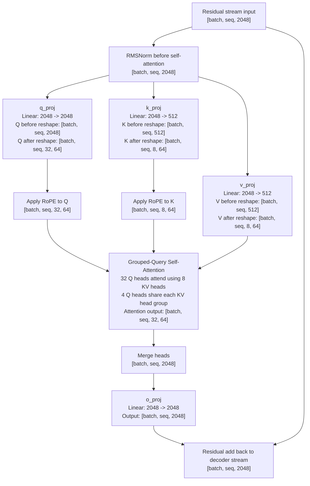
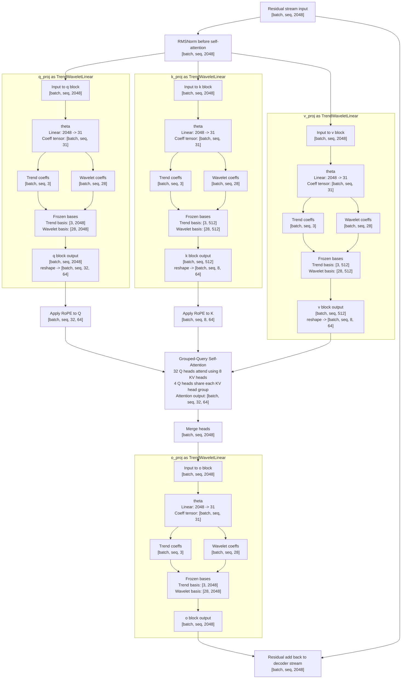

# Llama 3.2-1B Attention Projection Diagram

This diagram shows where the projection layers sit inside a single Llama 3.2-1B decoder self-attention block.

Note: the request listed `o_proj, k_proj, v_proj, and o_proj`. I assumed the first `o_proj` was intended to be `q_proj`, since the attention layer uses `q_proj`, `k_proj`, `v_proj`, and `o_proj`.

## Model dimensions used

- Hidden size: `2048`
- Query heads: `32`
- Key/value heads: `8`
- Head dimension: `64`
- Grouped-query attention ratio: `32 / 8 = 4` query heads per KV head

## Mermaid diagram

## Mermaid diagram with `TrendWaveletLinear` inserted

This is the same decoder self-attention block, but with each attention projection
(`q_proj`, `k_proj`, `v_proj`, `o_proj`) replaced by `TrendWaveletLinear`.

Using the defaults in this repo:

- `trend_dim = 3`
- `wavelet_dim = 28`
- Total coefficient width inside each `TrendWaveletLinear` block: `31`

## Projection summary

| Layer | Weight shape | Input width | Output width | Interpreted tensor shape |
|---|---:|---:|---:|---|
| `q_proj` | `2048 x 2048` | `2048` | `2048` | `32` heads x `64` |
| `k_proj` | `512 x 2048` | `2048` | `512` | `8` heads x `64` |
| `v_proj` | `512 x 2048` | `2048` | `512` | `8` heads x `64` |
| `o_proj` | `2048 x 2048` | `2048` | `2048` | merged `32 x 64` back to model width |

## `TrendWaveletLinear` summary

With the repo defaults (`trend_dim = 3`, `wavelet_dim = 28`, `wavelet_type = db3`),
each replaced attention projection uses:

| Layer | `theta` shape | Coeff width | Frozen basis shapes | Block output width |
|---|---:|---:|---|---:|
| `q_proj` | `31 x 2048` | `31 = 3 + 28` | trend `[3, 2048]`, wavelet `[28, 2048]` | `2048` |
| `k_proj` | `31 x 2048` | `31 = 3 + 28` | trend `[3, 512]`, wavelet `[28, 512]` | `512` |
| `v_proj` | `31 x 2048` | `31 = 3 + 28` | trend `[3, 512]`, wavelet `[28, 512]` | `512` |
| `o_proj` | `31 x 2048` | `31 = 3 + 28` | trend `[3, 2048]`, wavelet `[28, 2048]` | `2048` |

## Sources

- Hugging Face Llama config docs: https://huggingface.co/docs/transformers/v4.51.3/model_doc/llama
- Llama 3.2-1B config mirror showing `hidden_size=2048`, `num_attention_heads=32`, `num_key_value_heads=8`, `head_dim=64`: https://huggingface.co/onnx-community/Llama-3.2-1B/blob/main/config.json
