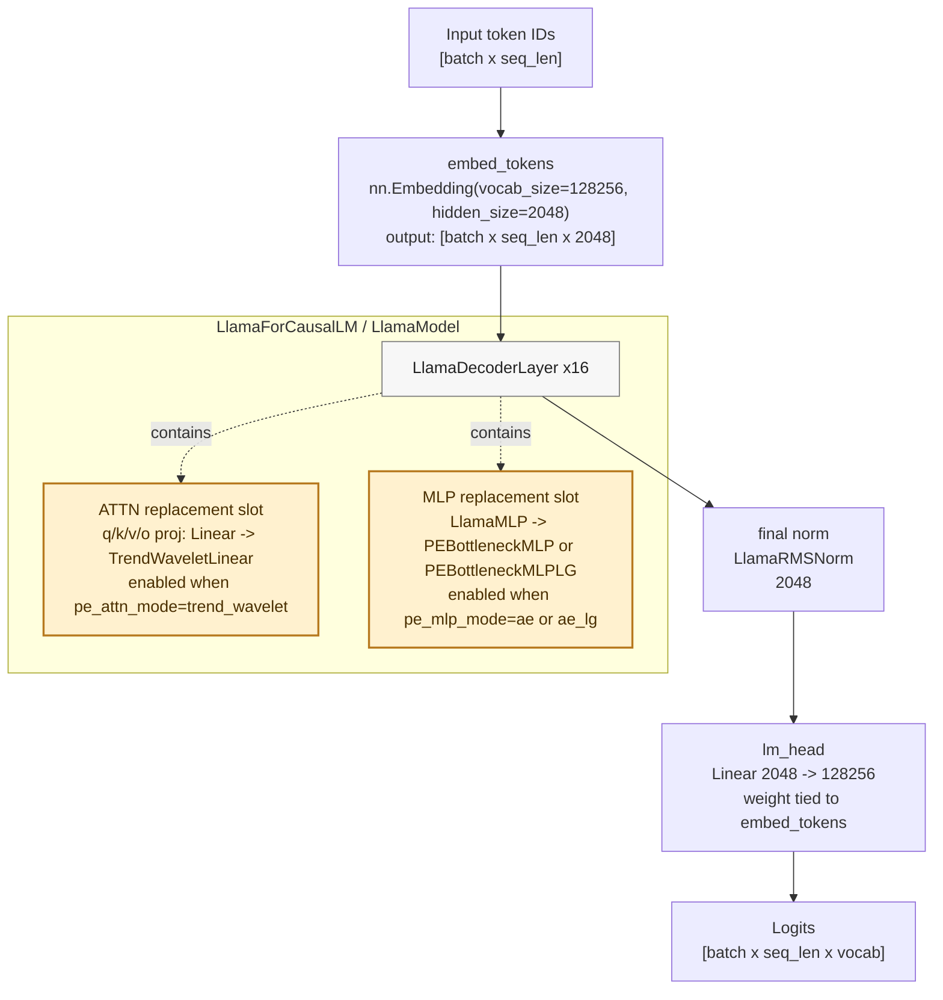
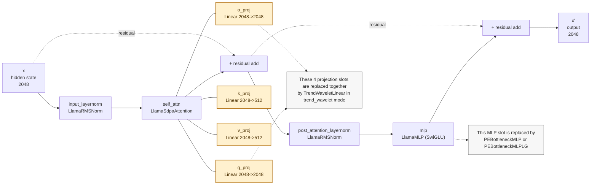
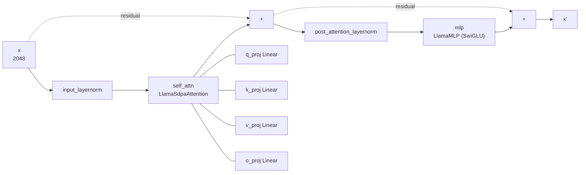
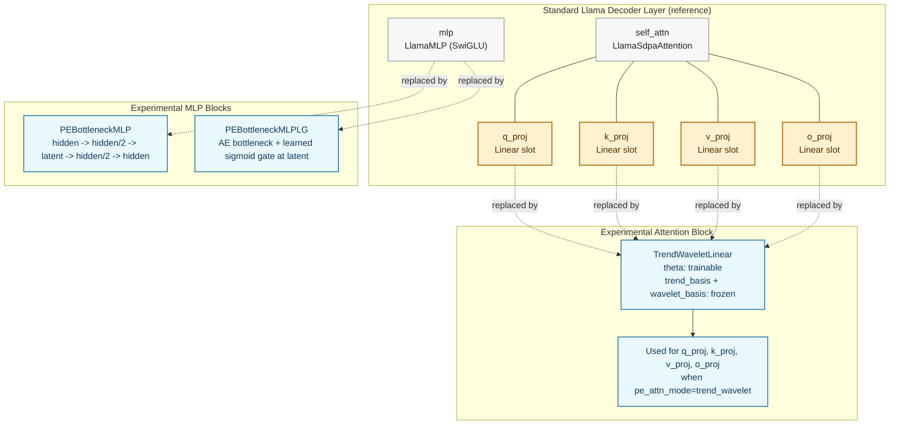
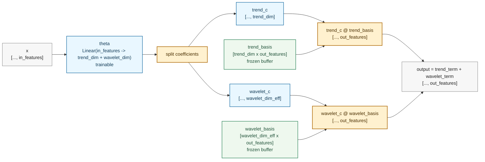
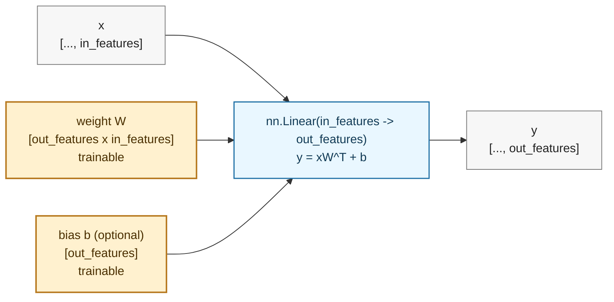
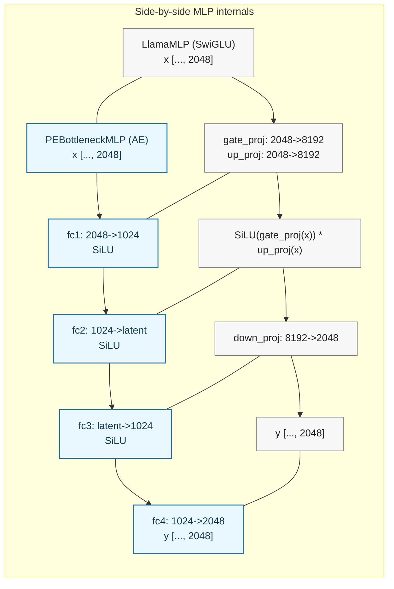
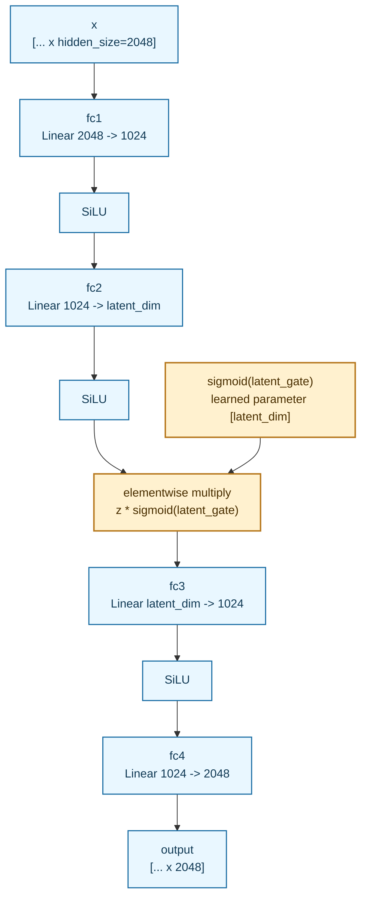

# PELLM: Parameter-Efficient LLM Layers

N-BEATS-inspired parameter-efficient replacements for standard Llama attention projections and MLP blocks. Wraps `meta-llama/Llama-3.2-1B-Instruct` with two independent extension points that can be tested separately or combined.

## Inspiration

This project ports proven architectures from the N-BEATS Lightning codebase (included in this archive under `../nbeats/`), a time-series forecasting framework, into the LLM domain:

- **TrendWaveletLinear** (attention projections) — from the `TrendWaveletAE` block. Replaces dense `nn.Linear` layers with a factorized representation: input is projected to a small coefficient vector, then expanded through two frozen basis matrices (Vandermonde polynomial + SVD-orthonormalized DWT). Only the coefficient projection is trainable, yielding ~97% parameter reduction per attention layer.

- **PEBottleneckMLP** (MLP replacement) — from the `AERootBlock` backbone. Replaces the 3-projection SwiGLU MLP (gate + up + down, totaling 50.3M params/layer) with a 4-layer autoencoder bottleneck (`hidden -> hidden/2 -> latent -> hidden/2 -> hidden`), yielding ~90% parameter reduction.

- **PEBottleneckMLPLG** (MLP with learned gate) — from the `AERootBlockLG` backbone. Same as above but adds a learnable `sigmoid(gate) * z` at the bottleneck, letting the network discover effective latent dimensionality during training.

## Install

```bash
pip install -e ".[experiments]"   # installs all dependencies for paper experiments
```

Requires Python >= 3.10, PyTorch >= 2.1 (CUDA build), Transformers >= 4.40.

## Hardware Requirements

PELLM experiments require a **CUDA-capable NVIDIA GPU** with at least **16 GB VRAM**.
The smol-replacement pretraining uses `accelerate launch` and was developed on 2× RTX 5090
(32 GB each); a single 24 GB GPU works with the default settings.

Run the pre-flight check **before committing to a long run**:

```bash
python scripts/check_hardware.py
```

The script will print one of:

- `[ OK ]` — CUDA found, VRAM sufficient, `accelerate` importable; ready to train.
- `[WARN]` — CUDA found but VRAM is below 24 GB; training may OOM at default batch
  settings — see the warning message for mitigation steps.
- `[FAIL]` — **No CUDA GPU detected.** This means the machine cannot run the PELLM
  training experiments. Pre-computed lm-eval-harness results are available in
  `evals/smol_replacement_paper/` for reviewer inspection without retraining.

## Target Model

`meta-llama/Llama-3.2-1B-Instruct`: 16 decoder layers, hidden_size=2048, 32 Q-heads / 8 KV-heads, head_dim=64, intermediate_size=8192.

## Architecture

Two independent axes of modification, controlled by config flags:

| Component | Mode | Layer class | Description |
| --- | --- | --- | --- |
| Attention | `standard` | `PELinear` | Identical to `nn.Linear` (baseline) |
| Attention | `trend_wavelet` | `TrendWaveletLinear` | Frozen Vandermonde + DWT basis expansion |
| MLP | `standard` | `LlamaMLP` | Standard SwiGLU (baseline) |
| MLP | `ae` | `PEBottleneckMLP` | AE bottleneck |
| MLP | `ae_lg` | `PEBottleneckMLPLG` | AE bottleneck with learned gate |

### Parameter Savings

**Attention projections (trend_wavelet, basis_dim=32 = trend_dim 4 + wavelet_dim 28):**

| Projection | Standard | TrendWaveletLinear | Savings |
|---|---|---|---|
| q_proj (2048 -> 2048) | 4.19M | 65.5K | 98.4% |
| k_proj (2048 -> 512) | 1.05M | 65.5K | 93.8% |
| v_proj (2048 -> 512) | 1.05M | 65.5K | 93.8% |
| o_proj (2048 -> 2048) | 4.19M | 65.5K | 98.4% |
| **All 16 layers** | **168M** | **4.2M** | **97.5%** |

**MLP (ae/ae_lg, latent_dim=256):**

| Component | Standard SwiGLU | AE Bottleneck | Savings |
|---|---|---|---|
| Per layer | 50.3M | 4.7M | 90.7% |
| **All 16 layers** | **805M** | **75.5M** | **90.6%** |

## Paper Experiments

The two experiments referenced in the paper are:

1. **AE pretraining** — `scripts/experiments/ae_pretrain_loss_sweep.yaml`
2. **Smol-replacement paper** — `scripts/experiments/smol_replacement_paper.yaml`

### Step 1 — Hardware check

```bash
python scripts/check_hardware.py
```

Exit 0 = ready to train. Exit 1 = CUDA GPU unavailable; inspect
`evals/smol_replacement_paper/` for pre-computed results instead.

### Step 2 — Model access

Accept the Llama 3.2 Community License on Hugging Face, then authenticate:

```bash
huggingface-cli login
```

The smol-replacement experiment uses `HuggingFaceTB/SmolLM2-135M` (public,
no license gate). The AE-pretraining experiment targets
`meta-llama/Llama-3.2-1B-Instruct` and **requires** the HF login above.

### Step 3 — Artifact directories

```bash
python scripts/setup_artifact_dirs.py
```

### Experiment A: AE pretraining loss sweep

Sweeps 7 pre-training loss functions (MSE, cosine, Huber, soft-KL at T=2/4,
combined α=0.5/0.8) for the AE-bottleneck MLP replacement of Llama layer 15.
Runs `finetune.py` with `ae_pretrain_epochs=5` and `epochs=0` (eval only after
pre-training). GPU required; ~5-10 min per config on a 24 GB GPU.

```bash
python scripts/run_from_yaml.py scripts/experiments/ae_pretrain_loss_sweep.yaml
```

Run a single config only:

```bash
python scripts/run_from_yaml.py scripts/experiments/ae_pretrain_loss_sweep.yaml \
    --config loss_mse
```

Dry-run (no training):

```bash
python scripts/run_from_yaml.py scripts/experiments/ae_pretrain_loss_sweep.yaml \
    --dry-run
```

### Experiment B: Smol-replacement paper

From-scratch Smol-style architecture comparison: trains 30+ architecture
variants (baseline, TrendWavelet attention, AE MLP, combined) from random
initialization on FineWeb-edu. Each variant trains to a 3 B-token budget.
Designed for parallel execution: **one variant per GPU, two in parallel**.

**Single-variant launch (one GPU):**

```bash
# First check a dry-run
python scripts/pretrain_smol_replacement.py \
    scripts/experiments/smol_replacement_paper.yaml \
    --variant ae_mlp --dry-run

# Full run
CUDA_VISIBLE_DEVICES=0 accelerate launch --num_processes 1 \
    scripts/pretrain_smol_replacement.py \
    scripts/experiments/smol_replacement_paper.yaml \
    --variant tw_root_fc_db3_64_tiered_silu
```

**Parallel launcher (two variants concurrently on two GPUs):**

```bash
python scripts/run_smol_replacement_parallel.py \
    scripts/experiments/smol_replacement_paper.yaml
```

Pre-computed lm-eval-harness results for `baseline`, `ae_mlp`, and
`tw_root_fc_db3_64_tiered_silu` are under `evals/smol_replacement_paper/`.

## Experiments (exploratory / ablation)

All experiments below use `scripts/finetune.py`. Each run loads pretrained Llama weights, measures baseline perplexity on the selected dataset, optionally fine-tunes, then measures final perplexity.

### Experiment 0: Baseline (no modifications)

Establish the reference perplexity with the unmodified model.

```bash
python scripts/finetune.py \
    --pe-attn-mode standard \
    --pe-mlp-mode standard \
    --epochs 0
```

### Experiment 1: TrendWavelet Attention Only

Test the TrendWavelet attention projection replacement in isolation. MLP is unchanged (standard SwiGLU). Pretrained attention weights are projected onto the combined basis via pseudo-inverse.

```bash
python scripts/finetune.py \
    --pe-attn-mode trend_wavelet \
    --pe-mlp-mode standard \
    --trend-dim 4 \
    --wavelet-dim 28 \
    --wavelet-type db3 \
    --epochs 3 --lr 1e-4 --batch-size 4
```

**Variations to try:**

```bash
# Different wavelet families
python scripts/finetune.py \
    --pe-attn-mode trend_wavelet --pe-mlp-mode standard \
    --wavelet-type haar --epochs 3 --lr 1e-4

python scripts/finetune.py \
    --pe-attn-mode trend_wavelet --pe-mlp-mode standard \
    --wavelet-type sym5 --epochs 3 --lr 1e-4

# Larger basis (more coefficients, less compression)
python scripts/finetune.py \
    --pe-attn-mode trend_wavelet --pe-mlp-mode standard \
    --trend-dim 8 --wavelet-dim 56 --epochs 3 --lr 1e-4

# Higher-frequency band (skip low-frequency rows)
python scripts/finetune.py \
    --pe-attn-mode trend_wavelet --pe-mlp-mode standard \
    --wavelet-basis-offset 16 --epochs 3 --lr 1e-4

# Per-layer frequency sweep (low -> high across 16 layers)
python scripts/finetune.py \
    --pe-attn-mode trend_wavelet --pe-mlp-mode standard \
    --0 \
    --epochs 3 --lr 1e-4
```

### Experiment 2: AE Bottleneck MLP Only

Test the AE-bottleneck MLP replacement in isolation. Attention is unchanged (standard PELinear). MLP layers are randomly initialized (architecture is fundamentally different from SwiGLU).

```bash
python scripts/finetune.py \
    --pe-attn-mode standard \
    --pe-mlp-mode ae \
    --ae-latent-dim 256 \
    --epochs 3 --lr 1e-4 --batch-size 4
```

**Variations to try:**

```bash
# Smaller bottleneck (more compression, more parameter savings)
python scripts/finetune.py \
    --pe-attn-mode standard --pe-mlp-mode ae \
    --ae-latent-dim 128 --epochs 3 --lr 1e-4

# Larger bottleneck (less compression, closer to original capacity)
python scripts/finetune.py \
    --pe-attn-mode standard --pe-mlp-mode ae \
    --ae-latent-dim 512 --epochs 3 --lr 1e-4

# AE pre-training with diverse FineWeb activations
python scripts/finetune.py \
    --pe-attn-mode standard --pe-mlp-mode ae \
    --ae-latent-dim 256 --ae-pretrain-epochs 10 \
    --ae-dataset fineweb --ae-cache-num-samples 10000 \
    --epochs 3 --lr 1e-4
```

### Experiment 3: AE Bottleneck MLP with Learned Gate Only

Same as experiment 2 but with the learned-gate variant. After training, the script prints per-layer gate statistics showing which latent dimensions the network kept active.

```bash
python scripts/finetune.py \
    --pe-attn-mode standard \
    --pe-mlp-mode ae_lg \
    --ae-latent-dim 256 \
    --epochs 3 --lr 1e-4 --batch-size 4
```

**Variations to try:**

```bash
# Over-provision latent dim and let gate prune
python scripts/finetune.py \
    --pe-attn-mode standard --pe-mlp-mode ae_lg \
    --ae-latent-dim 512 --epochs 5 --lr 1e-4
```

### Experiment 4: TrendWavelet Attention + AE MLP (Combined)

Test both replacements together. This is the maximum compression configuration.

```bash
python scripts/finetune.py \
    --pe-attn-mode trend_wavelet \
    --attn-init pretrained \
    --pe-mlp-mode ae_lg \
    --trend-dim 4 --wavelet-dim 28 --wavelet-type db3 \
    --ae-latent-dim 256 \
    --epochs 3 --lr 1e-4 --batch-size 4
```

### Experiment 5: TrendWavelet Attention + AE MLP + Per-Layer Frequency Sweep

Combined mode with mixed frequency bands across layers.

```bash
python scripts/finetune.py \
    --pe-attn-mode trend_wavelet \
    --pe-mlp-mode ae_lg \
    --ae-latent-dim 256 \
    --per-layer-offsets 0 0 4 4 8 8 12 12 16 16 20 20 24 24 28 28 \
    --epochs 3 --lr 1e-4 --batch-size 4
```

## Disk Cleanup

Large YAML sweeps can leave shared activation caches behind if a run is interrupted or fails mid-extraction. Before launching another big sweep, or whenever disk usage spikes unexpectedly, preview reclaimable generated artifacts with:

```bash
.venv/bin/python scripts/prune_experiment_artifacts.py
```

Apply the safe cache cleanup:

```bash
.venv/bin/python scripts/prune_experiment_artifacts.py --apply
```

Target one experiment only:

```bash
.venv/bin/python scripts/prune_experiment_artifacts.py --experiment trendwavelet_layer15_sweep --apply
```

Optional, higher-impact cleanup:

- Add `--include-checkpoints` to remove `trainedmodels/<experiment>/` directories.
- Add `--include-wandb` to remove local `wandb/` run folders after runs have already synced to W&B.

## Artifact Storage

Heavy training artifacts should live on the large data drive under
`<pellm_data_root>` rather than inside the git checkout. The YAML orchestrators
default model checkpoints, run logs, caches, and temporary files to that root
unless the environment or YAML explicitly overrides them.

Create the canonical directories with:

```bash
python scripts/setup_artifact_dirs.py
```

See [docs/artifact_storage_and_publishing.md](docs/artifact_storage_and_publishing.md)
for the full directory layout and Hugging Face publishing workflow.

## Smol Replacement Paper Experiment

The from-scratch architecture experiment lives in
`scripts/experiments/smol_replacement_paper.yaml` and is run with
`scripts/pretrain_smol_replacement.py`. This is the recommended path for the
paper pivot; it is separate from the older pretrained Llama replacement/repair
pipelines.

See [docs/smol_replacement_experiment.md](docs/smol_replacement_experiment.md)
for start commands and data-source behavior.

## CLI Reference

```text
scripts/finetune.py

Model:
  --model-name          Base Llama model (default: meta-llama/Llama-3.2-1B-Instruct)

Attention:
  --pe-attn-mode        standard | trend_wavelet (default: standard)
  --attn-init           pretrained | lstsq | svd | cur | fourier | random
  --trend-dim           Vandermonde polynomial degree (default: 4)
  --wavelet-dim         DWT basis rows (default: 28)
  --wavelet-type        PyWavelets family string (default: db3)
  --wavelet-basis-offset  Frequency band offset, 0=low (default: 0)
  --per-layer-offsets   Space-separated per-layer basis_offset overrides

MLP:
  --pe-mlp-mode         standard | ae | ae_lg (default: standard)
  --ae-latent-dim       AE bottleneck width (default: 256)

Dataset:
  --dataset             wikitext2 | wikitext103 | fineweb (default: wikitext2)
                        Main LM fine-tuning and perplexity benchmark dataset.
                        wikitext2: ~2M tokens; wikitext103: ~103M tokens;
                        fineweb: streaming subset of HuggingFaceFW/fineweb.
  --dataset-num-samples Raw documents to stream when --dataset fineweb (default: 50000)
                        Train uses N docs; val and test each use N/10 docs.

Attention Pre-training:
  --attn-pretrain-epochs  Reconstruction pre-training epochs for TrendWavelet attention (default: 0)
  --attn-dataset          wikitext2 | wikitext103 | fineweb (default: wikitext2)
  --attn-cache-dir        Directory for cached teacher attention activations
  --attn-cache-num-samples  FineWeb sample count for attention caching (default: 10000)

AE Pre-training:
  --ae-pretrain-epochs  Reconstruction pre-training epochs (default: 0)
  --ae-dataset          wikitext2 | fineweb — AE activation caching only,
                        independent of --dataset (default: wikitext2)
  --ae-cache-num-samples  Raw text samples for fineweb caching (default: 10000)
  --ae-cache-dir        Persistent activation cache directory (default: temp)

Training:
  --epochs              Number of fine-tuning epochs, 0=eval only (default: 3)
  --lr                  Learning rate (default: 1e-4)
  --batch-size          Batch size (default: 4)
  --max-length          Max sequence length (default: 512)
  --grad-accum-steps    Gradient accumulation steps (default: 4)
  --max-eval-batches    Max batches for perplexity eval, 0=all (default: 50)

Output:
  --output-dir          Directory to save fine-tuned model
  --dtype               float32 | float16 | bfloat16 (default: float32)
```

## Weight Initialization

- **TrendWavelet attention**: Pretrained weights are projected onto the combined basis via pseudo-inverse (`W @ pinv(B)`). This gives a least-squares optimal approximation with some reconstruction loss due to the dimensionality reduction.
- **AE MLP**: Randomly initialized. The AE bottleneck has fundamentally different architecture than SwiGLU, so no clean projection exists. Fine-tuning is required.
- **Everything else** (embeddings, layer norms, lm_head): Copied directly from the pretrained checkpoint.

## Llama 3.2-1B Architecture Reference



### Decoder Layer with Explicit Replacement Slots



### Unmodified Decoder Layer (Reference)



### Experimental Blocks and Replacement Points



### TrendWaveletLinear Block Internals



### Standard Linear Projection Block (Reference)

In `standard` mode this is exactly a plain `nn.Linear` projection.



### MLP Block Internals (LlamaMLP vs PEBottleneckMLP)



### PEBottleneckMLPLG Internals (Learned-Gate Variant)


